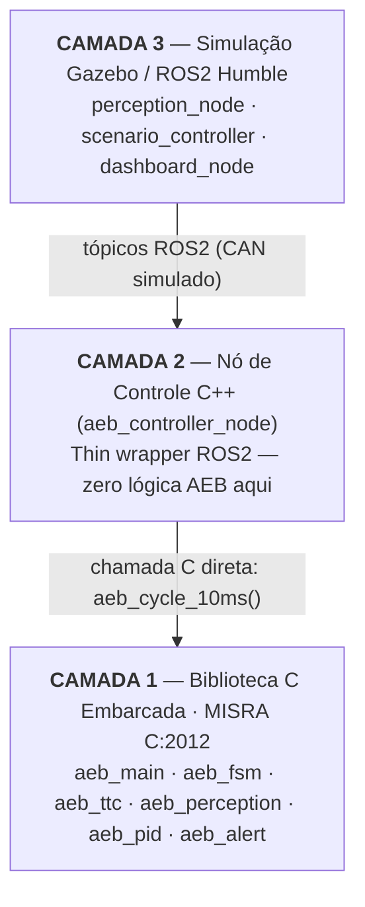
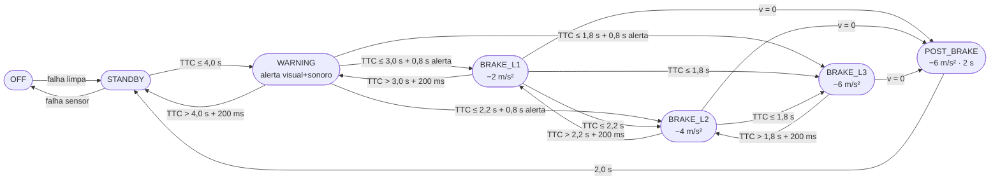

# Sistema de Frenagem Autônoma de Emergência (AEB)

> **Residência Tecnológica Stellantis — Desenvolvimento de Software Embarcado para o Setor Automotivo**
> Universidade Federal de Pernambuco (UFPE) · Centro de Informática · FACEPE

[](https://www.misra.org.uk/)
[](https://www.iso.org/standard/68383.html)
[](https://gazebosim.org/)
[]()

---

## Visão Geral

Este repositório implementa um sistema AEB (*Autonomous Emergency Braking*) completo em três camadas, desenvolvido como projeto final da Residência Tecnológica Stellantis. O sistema detecta risco de colisão traseira, emite alertas progressivos ao motorista e aplica frenagem autônoma de emergência — tudo com código C embarcado compatível com microcontroladores automotivos reais.



### Cenários Validados (Euro NCAP CCR)

| Cenário | Velocidade Ego | Velocidade Alvo | Distância Inicial | Critério de Aprovação |
|---------|---------------|-----------------|-------------------|-----------------------|
| **CCRs** — Alvo Estacionário | 20–50 km/h | 0 km/h | 100 m | Parada completa ou v < 5 km/h |
| **CCRm** — Alvo em Movimento | 50 km/h | 20 km/h | 100 m | Colisão evitada ou redução ≥ 20 km/h |
| **CCRb** — Alvo Freando | 50 km/h | 50 km/h → 0 | 12–40 m | Colisão evitada ou v_impacto < 15 km/h |

---

## Arquitetura do Sistema

### Camada 1 — C Embarcado

Todo o algoritmo AEB reside em 6 módulos C independentes de plataforma:

| Arquivo | Responsabilidade |
|---------|-----------------|
| `c_embedded/src/aeb_main.c` | Ciclo de 10 ms — orquestra todos os módulos |
| `c_embedded/src/aeb_perception.c` | Validação e fusão de dados dos sensores |
| `c_embedded/src/aeb_ttc.c` | Cálculo de TTC e distância de frenagem |
| `c_embedded/src/aeb_fsm.c` | Máquina de estados de 7 estados |
| `c_embedded/src/aeb_pid.c` | Controlador PI com limitador de jerk |
| `c_embedded/src/aeb_alert.c` | Lógica de alertas visuais e sonoros |
| `c_embedded/include/aeb_config.h` | **Todos** os parâmetros calibráveis |

### Camada 2 — Nó ROS2 C++

`gazebo_sim/aeb_gazebo/src/aeb_controller_node.cpp` compila os 6 módulos C diretamente no executável ROS2. Não contém nenhuma lógica AEB — apenas:
- Assina `/can/radar_target` e `/can/ego_vehicle`
- Chama `aeb_cycle_10ms()` a cada 10 ms
- Publica `/can/brake_cmd`, `/can/fsm_state` e `/can/alert`

### Camada 3 — Simulação Gazebo

| Nó | Função |
|----|--------|
| `perception_node.py` | Simula sensores (Radar 77 GHz + Lidar), fusão ponderada, publica frames CAN |
| `scenario_controller.py` | Executa cenários Euro NCAP, aplica comandos de velocidade, detecta colisão |
| `dashboard_node.py` | Dashboard matplotlib em tempo real com velocímetro, TTC, FSM e barra de freio |

### Barramento CAN Simulado

Mensagens estruturadas que espelham o arquivo DBC real (`can/aeb_system.dbc`):

| Tópico ROS2 | Mensagem | ID CAN | Período | Origem |
|-------------|----------|--------|---------|--------|
| `/can/radar_target` | `AebRadarTarget` | 0x120 | 20 ms | `perception_node` |
| `/can/ego_vehicle` | `AebEgoVehicle` | 0x100 | 10 ms | `perception_node` |
| `/can/brake_cmd` | `AebBrakeCmd` | 0x080 | 10 ms | `aeb_controller_node` |
| `/can/fsm_state` | `AebFsmState` | 0x200 | 50 ms | `aeb_controller_node` |
| `/can/alert` | `AebAlert` | 0x300 | Evento | `aeb_controller_node` |

---

## Máquina de Estados (7 Estados)



**Piso de distância** (impede de-escalada prematura enquanto freando):
- d ≤ 20 m → mantém mínimo BRAKE_L1
- d ≤ 10 m → mantém mínimo BRAKE_L2
- d ≤ 5 m → mantém mínimo BRAKE_L3

---

## Pré-requisitos

### Sistema Operacional
- **WSL2** com Ubuntu 22.04 (Windows 11)
- **ROS2 Humble** ([guia de instalação oficial](https://docs.ros.org/en/humble/Installation/Ubuntu-Install-Debians.html))
- **Gazebo Classic 11** (`sudo apt install ros-humble-gazebo-ros-pkgs`)
- **Python 3.10+** com `matplotlib`, `PyQt5`

### Ferramentas de Compilação
```bash
sudo apt install python3-colcon-common-extensions gcc build-essential
```

---

## Instalação e Configuração

### 1. Configurar o Workspace ROS2

```bash
mkdir -p ~/aeb_ws/src
cd ~/aeb_ws/src
ln -s /mnt/c/Users/<usuario>/Codigos/Pos/AEB/modeling/gazebo_sim/aeb_gazebo aeb_gazebo
```

### 2. Compilar

```bash
cd ~/aeb_ws
colcon build --packages-select aeb_gazebo
source install/setup.bash
```

### 3. Verificar Instalação

```bash
ros2 pkg list | grep aeb_gazebo
# Deve aparecer: aeb_gazebo
```

---

## Executando os Cenários

### Script de Execução Rápida

```bash
# CCRs — Alvo Estacionário a 50 km/h
./gazebo_sim/aeb_gazebo/run.sh ccrs_50

# CCRm — Alvo em Movimento
./gazebo_sim/aeb_gazebo/run.sh ccrm

# CCRb — Alvo Freando (desaceleração −2 m/s², gap 40 m)
./gazebo_sim/aeb_gazebo/run.sh ccrb_d2_g40
```

### Todos os Cenários Disponíveis

| Comando | Ego (km/h) | Alvo (km/h) | Gap (m) | Decel Alvo |
|---------|-----------|------------|---------|------------|
| `ccrs_20` | 20 | 0 | 100 | — |
| `ccrs_30` | 30 | 0 | 100 | — |
| `ccrs_40` | 40 | 0 | 100 | — |
| `ccrs_50` | 50 | 0 | 100 | — |
| `ccrm` | 50 | 20 | 100 | — |
| `ccrb_d2_g12` | 50 | 50 | 12 | −2 m/s² |
| `ccrb_d2_g40` | 50 | 50 | 40 | −2 m/s² |
| `ccrb_d6_g12` | 50 | 50 | 12 | −6 m/s² |
| `ccrb_d6_g40` | 50 | 50 | 40 | −6 m/s² |

### Via Launch File ROS2

```bash
source ~/aeb_ws/install/setup.bash
ros2 launch aeb_gazebo aeb_scenario.launch.py scenario:=ccrs_40
```

---

## Parâmetros de Calibração

Todos os parâmetros estão em `c_embedded/include/aeb_config.h`. Alterações requerem recompilação.

| Parâmetro | Valor | Descrição |
|-----------|-------|-----------|
| `TTC_WARNING` | 4,0 s | TTC para alerta |
| `TTC_BRAKE_L1` | 3,0 s | TTC para frenagem nível 1 |
| `TTC_BRAKE_L2` | 2,2 s | TTC para frenagem nível 2 |
| `TTC_BRAKE_L3` | 1,8 s | TTC para frenagem nível 3 |
| `DECEL_L1` | 2,0 m/s² | Desaceleração nível 1 |
| `DECEL_L2` | 4,0 m/s² | Desaceleração nível 2 |
| `DECEL_L3` | 6,0 m/s² | Desaceleração nível 3 |
| `V_EGO_MIN` | 1,39 m/s (5 km/h) | Velocidade mínima de ativação |
| `V_EGO_MAX` | 16,67 m/s (60 km/h) | Velocidade máxima de ativação |
| `HYSTERESIS_TIME` | 0,2 s | Histerese para de-escalada |
| `WARNING_TO_BRAKE_MIN` | 0,8 s | Tempo mínimo de alerta antes da frenagem |
| `POST_BRAKE_HOLD` | 2,0 s | Tempo de manutenção pós-parada |
| `D_BRAKE_L1` | 20 m | Piso de distância para L1 |
| `D_BRAKE_L2` | 10 m | Piso de distância para L2 |
| `D_BRAKE_L3` | 5 m | Piso de distância para L3 |
| `MAX_JERK` | 100 m/s³ | Limite de jerk do atuador |
| `PID_KP` | 10,0 | Ganho proporcional do PID |
| `PID_KI` | 0,05 | Ganho integral do PID |

---

## Estrutura do Repositório

```
modeling/
├── c_embedded/                  # Código C embarcado (MISRA C:2012)
│   ├── include/
│   │   ├── aeb_config.h         # ← Todos os parâmetros calibráveis
│   │   ├── aeb_types.h          # Tipos e estruturas
│   │   └── aeb_*.h              # Interfaces dos módulos
│   ├── src/
│   │   ├── aeb_main.c           # Ciclo de controle de 10 ms
│   │   ├── aeb_fsm.c            # Máquina de estados (7 estados)
│   │   ├── aeb_ttc.c            # Cálculo de TTC e d_brake
│   │   ├── aeb_perception.c     # Validação de sensores e detecção de falhas
│   │   ├── aeb_pid.c            # Controlador PI + limitador de jerk
│   │   └── aeb_alert.c          # Flags de alertas visuais/sonoros
│   └── test/
│       └── test_aeb.c           # Testes unitários
├── gazebo_sim/
│   └── aeb_gazebo/              # Pacote ROS2
│       ├── src/
│       │   ├── aeb_controller_node.cpp  # Wrapper C++ → biblioteca C
│       │   ├── perception_node.py       # Simulação de sensores + fusão
│       │   ├── scenario_controller.py   # Execução dos cenários CCR
│       │   └── dashboard_node.py        # Dashboard em tempo real
│       ├── msg/                 # Mensagens CAN estruturadas (DBC)
│       ├── launch/              # Launch files por cenário
│       ├── worlds/              # Mundo Gazebo (pista rodoviária)
│       ├── models/              # Modelos 3D dos veículos
│       └── run.sh               # Script de execução rápida
├── python_sil/                  # SIL em Python (referência)
│   ├── fsm.py                   # FSM equivalente
│   ├── pid_controller.py        # PID equivalente
│   └── main_sim.py              # Simulação integrada
├── can/
│   └── aeb_system.dbc           # Definição do barramento CAN
├── diagrams/                    # Diagramas da arquitetura (Mermaid + PNG)
└── results/                     # Resultados das simulações
```

---

## Conformidade e Normas

| Aspecto | Norma / Padrão | Status |
|---------|---------------|--------|
| Código C embarcado | MISRA C:2012 | ✅ Implementado |
| Segurança funcional | ISO 26262 ASIL-B | ✅ Arquitetura conforme |
| Cenários de teste | Euro NCAP AEB CCR v4.3 | ✅ CCRs, CCRm, CCRb |
| Protocolo AEB | UNECE R152 | ✅ Alerta ≥ 0,8 s antes da frenagem |
| Barramento CAN | Arquivo DBC proprietário | ✅ 5 frames estruturados |
| Fusão sensorial | ISO 15622 | ✅ Radar + Lidar ponderados |

---

## Autores

| Nome |
|------|
| Jessica Roberta de Souza Santos |
| Eryca Francyele de Moura e Silva |
| Lourenço Jamba Mphili |
| Rian Ithalo da Costa Linhares |
| Renato Silva Fagundes |

**Instituição:** Centro de Informática — UFPE
**Patrocinador:** Stellantis / FACEPE
**Data:** Março de 2026

---

## Wiki

Documentação técnica detalhada disponível na [Wiki do repositório](../../wiki):

- [Arquitetura do Sistema](../../wiki/Arquitetura-do-Sistema)
- [Módulos C Embarcado](../../wiki/Modulos-C-Embarcado)
- [Máquina de Estados](../../wiki/Maquina-de-Estados)
- [Controlador PID](../../wiki/Controlador-PID)
- [Barramento CAN](../../wiki/Barramento-CAN)
- [Simulação Gazebo](../../wiki/Simulacao-Gazebo)
- [Cenários de Teste](../../wiki/Cenarios-de-Teste)
- [Análise de Requisitos](../../wiki/Analise-de-Requisitos)
- [Guia de Desenvolvimento](../../wiki/Guia-de-Desenvolvimento)
