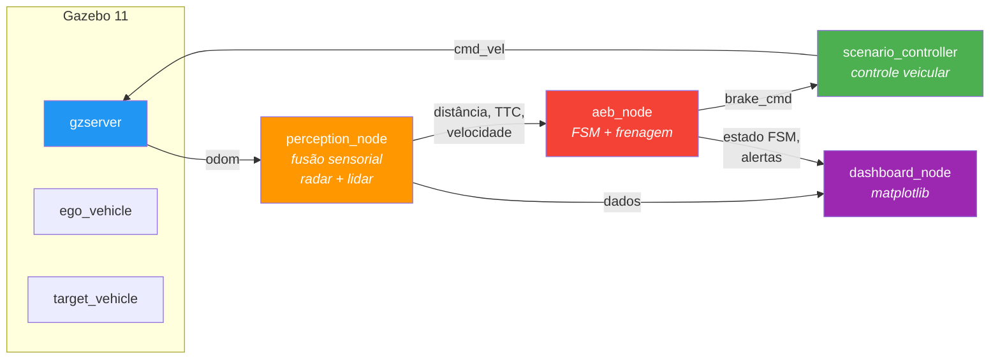

# Simulação AEB - Gazebo

Simulação em ROS 2 Humble + Gazebo Classic 11 de um sistema de **Frenagem Autônoma de Emergência (AEB)**, implementando cenários de teste Euro NCAP Car-to-Car (CCRs, CCRm, CCRb).

Projetado para execução em **Windows 11 + WSL2 (Ubuntu 22.04)**.

---

## Arquitetura



### Nós ROS 2

| Nó | Descrição |
|----|-----------|
| `scenario_controller.py` | Controla o movimento dos veículos, lê comandos de frenagem, detecta condições de fim de cenário |
| `perception_node.py` | Simula radar (77 GHz, σ=0,25 m) + lidar (σ=0,05 m) com fusão sensorial, verificação de plausibilidade (FR-PER-006) e detecção de falhas (FR-PER-007) |
| `aeb_node.py` | Controlador AEB baseado em FSM: STANDBY → WARNING → BRAKE_L1/L2/L3 → POST_BRAKE, com limiares de TTC conforme UNECE R152 |
| `dashboard_node.py` | Painel em tempo real com matplotlib: velocímetro, barra de TTC, estado da FSM, indicador de frenagem, alertas |

### Cenários

| Cenário | Vel. Ego | Vel. Alvo | Gap | Descrição |
|---------|----------|-----------|-----|-----------|
| `ccrs_20` | 20 km/h | 0 km/h | 100 m | Car-to-Car Rear Stationary |
| `ccrs_30` | 30 km/h | 0 km/h | 100 m | |
| `ccrs_40` | 40 km/h | 0 km/h | 100 m | |
| `ccrs_50` | 50 km/h | 0 km/h | 100 m | |
| `ccrm` | 50 km/h | 20 km/h | 100 m | Car-to-Car Rear Moving |
| `ccrb_d2_g12` | 50 km/h | 50 km/h | 12 m | Car-to-Car Rear Braking (desacel. = 2 m/s²) |
| `ccrb_d6_g12` | 50 km/h | 50 km/h | 12 m | Car-to-Car Rear Braking (desacel. = 6 m/s²) |
| `ccrb_d2_g40` | 50 km/h | 50 km/h | 40 m | Car-to-Car Rear Braking (desacel. = 2 m/s²) |
| `ccrb_d6_g40` | 50 km/h | 50 km/h | 40 m | Car-to-Car Rear Braking (desacel. = 6 m/s²) |

---

## Pré-requisitos

- **Windows 11** com WSL2 habilitado
- **Ubuntu 22.04** no WSL2
- **ROS 2 Humble** (instalação desktop)
- **Gazebo Classic 11** (incluso na instalação desktop do ROS 2 Humble)

---

## Instalação

### 1. Instalar WSL2 e Ubuntu 22.04

Abrir **PowerShell como Administrador**:

```powershell
wsl --install -d Ubuntu-22.04
```

Reiniciar se solicitado. Abrir **Ubuntu 22.04** pelo menu Iniciar e criar seu usuário.

### 2. Instalar ROS 2 Humble

No terminal Ubuntu:

```bash
# Configurar locale
sudo apt update && sudo apt install -y locales
sudo locale-gen en_US en_US.UTF-8
sudo update-locale LC_ALL=en_US.UTF-8 LANG=en_US.UTF-8
export LANG=en_US.UTF-8

# Adicionar repositório ROS 2
sudo apt install -y software-properties-common
sudo add-apt-repository universe
sudo apt update && sudo apt install -y curl
sudo curl -sSL https://raw.githubusercontent.com/ros/rosdistro/master/ros.key \
  -o /usr/share/keyrings/ros-archive-keyring.gpg
echo "deb [arch=$(dpkg --print-architecture) signed-by=/usr/share/keyrings/ros-archive-keyring.gpg] \
  http://packages.ros.org/ros2/ubuntu $(. /etc/os-release && echo $UBUNTU_CODENAME) main" | \
  sudo tee /etc/apt/sources.list.d/ros2.list > /dev/null

# Instalar ROS 2 Humble Desktop (inclui Gazebo 11)
sudo apt update
sudo apt install -y ros-humble-desktop

# Instalar dependências adicionais
sudo apt install -y \
  python3-colcon-common-extensions \
  ros-humble-gazebo-ros-pkgs \
  python3-pip \
  python3-pyqt5

pip3 install matplotlib

# Adicionar ROS 2 ao shell
echo "source /opt/ros/humble/setup.bash" >> ~/.bashrc
source ~/.bashrc
```

### 3. Baixar modelos 3D dos veículos

```bash
mkdir -p ~/.gazebo/models
git clone --depth 1 https://github.com/osrf/gazebo_models.git /tmp/gazebo_models
cp -r /tmp/gazebo_models/hatchback_blue ~/.gazebo/models/
cp -r /tmp/gazebo_models/hatchback ~/.gazebo/models/
cp -r /tmp/gazebo_models/suv ~/.gazebo/models/
rm -rf /tmp/gazebo_models
```

### 4. Clonar e compilar este pacote

```bash
# Clonar
mkdir -p ~/aeb_ws/src
cd ~/aeb_ws/src
git clone https://github.com/renatosfagundes/AEB_Sim.git aeb_gazebo

# Compilar
cd ~/aeb_ws
source /opt/ros/humble/setup.bash
colcon build --packages-select aeb_gazebo
source install/setup.bash

# Tornar nós Python executáveis
chmod +x ~/aeb_ws/src/aeb_gazebo/src/*.py
```

---

## Executando a Simulação

### Lançamento rápido (recomendado)

```bash
cd ~/aeb_ws/src/aeb_gazebo
./run.sh ccrs_40
```

### Lançamento manual

```bash
source /opt/ros/humble/setup.bash
source ~/aeb_ws/install/setup.bash
ros2 launch aeb_gazebo aeb_with_dashboard.launch.py scenario:=ccrs_40
```

### Trocar cenário

```bash
./run.sh ccrm           # Car-to-Car Rear Moving
./run.sh ccrb_d6_g40    # Car-to-Car Rear Braking
```

### O que você deve ver

1. **Janela do Gazebo** — Visualização 3D da pista com o veículo ego (hatchback azul) e o veículo alvo (SUV)
2. **Janela do Dashboard** — Painel em tempo real com velocímetro, TTC, estado da FSM, indicador de frenagem e alertas visuais/sonoros. Inclui botão **RESTART**.

---

## Tópicos ROS 2

| Tópico | Tipo | Descrição |
|--------|------|-----------|
| `/aeb/distance` | `Float64` | Distância fusionada até o alvo (m) |
| `/aeb/ego_speed` | `Float64` | Velocidade do veículo ego (km/h) |
| `/aeb/target_speed` | `Float64` | Velocidade do veículo alvo (km/h) |
| `/aeb/ttc` | `Float64` | Tempo para colisão (s) |
| `/aeb/brake_cmd` | `Float64` | Comando de frenagem (0–100%) |
| `/aeb/fsm_state` | `String` | Estado da FSM (STANDBY, WARNING, BRAKE_L1/L2/L3, POST_BRAKE) |
| `/aeb/alert_visual` | `Float64` | Alerta visual ativo (0/1) |
| `/aeb/alert_audible` | `Float64` | Alerta sonoro ativo (0/1) |
| `/aeb/sensor_fault` | `Float64` | Flag de falha do sensor (0/1) |
| `/aeb/scenario_status` | `String` | Resultado do cenário (STOPPED/COLLISION) |

---

## Resolução de Problemas

### Janela do Gazebo não aparece

O WSLg (GUI do WSL) é necessário. Verificar:

```bash
echo $DISPLAY
# Deve mostrar algo como :0
```

Se vazio, atualizar o WSL2 no PowerShell (Admin):

```powershell
wsl --update
```

### Gazebo muito lento

1. Fechar outros aplicativos pesados
2. Reiniciar o WSL2 entre execuções:
   ```powershell
   wsl --shutdown
   ```
3. Verificar que nenhum processo `gzserver` ficou preso:
   ```bash
   killall -9 gzserver gzclient 2>/dev/null
   ```

### Dashboard trava (SIGSEGV)

Instalar backend Qt5 para matplotlib:

```bash
sudo apt install -y python3-pyqt5
pip3 install PyQt5
```

### `python3\r: No such file or directory`

Os arquivos Python têm terminações de linha do Windows. Corrigir:

```bash
cd ~/aeb_ws/src/aeb_gazebo
find . -name "*.py" | xargs sed -i 's/\r$//'
```

### `colcon: command not found`

```bash
sudo apt install -y python3-colcon-common-extensions
```

---

## Limiares da FSM do AEB

| Transição | Limiar de TTC | Ação |
|-----------|--------------|------|
| STANDBY → WARNING | TTC < 4,0 s | Alerta visual LIGADO |
| WARNING → BRAKE_L1 | TTC < 3,0 s (após 800 ms) | 20% frenagem (2 m/s²) |
| BRAKE_L1 → BRAKE_L2 | TTC < 2,2 s | 40% frenagem (4 m/s²) |
| BRAKE_L2 → BRAKE_L3 | TTC < 1,8 s | 60% frenagem (6 m/s²) |
| Qualquer → POST_BRAKE | v_ego < 5 km/h | Manter 50% por 2 s |
| POST_BRAKE → STANDBY | Após 2 s | Liberar freio |

Faixa de velocidade operacional: 10–60 km/h (abaixo de 10 km/h, o sistema não desescala uma vez em frenagem).

---

## Referências

- UNECE Regulamento N.º 152 — Sistemas de Frenagem Autônoma de Emergência
- Euro NCAP AEB Car-to-Car Test Protocol v4.2
- ISO 22839 — Sistemas de mitigação de colisão frontal
- ISO 26262 — Segurança funcional para veículos rodoviários

---

## Licença

Este projeto faz parte de um trabalho acadêmico do programa de pós-graduação em Engenharia Eletrônica Automotiva.
