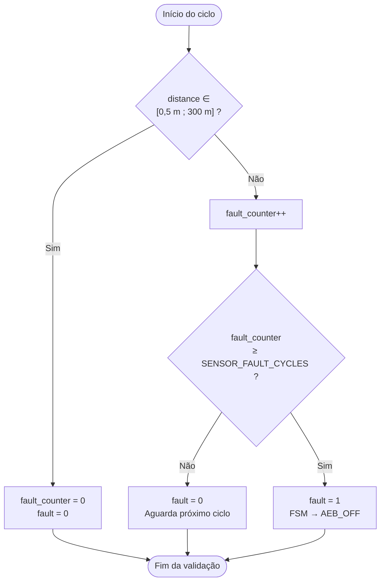
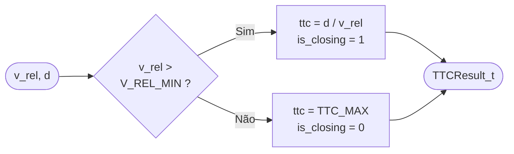
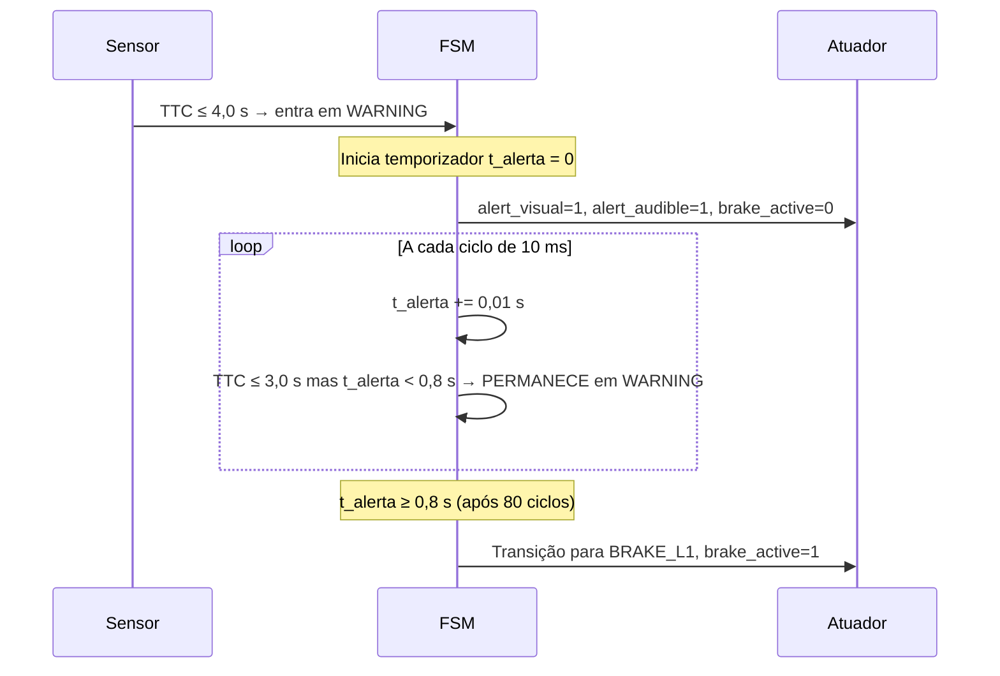
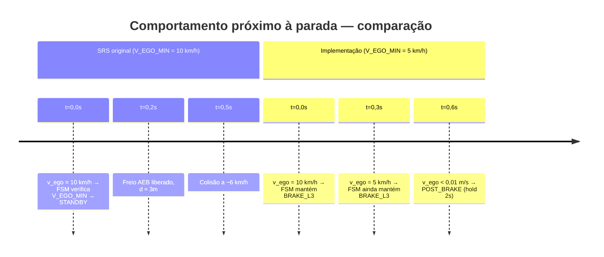
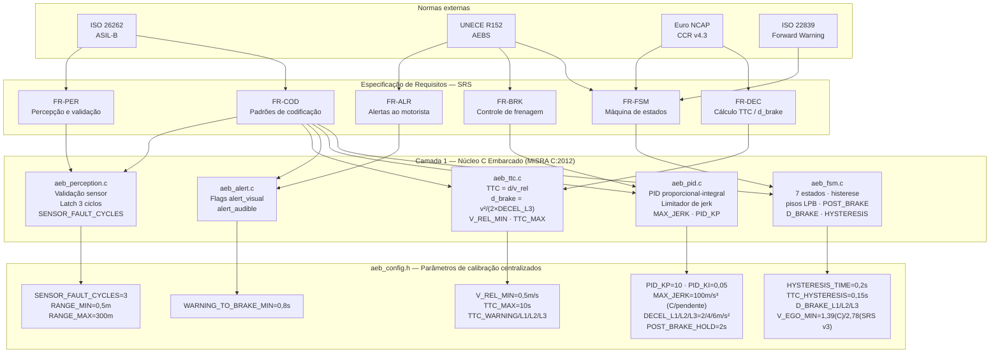

# Análise de Requisitos

> **Página:** Análise de Requisitos
> **Relacionado:** [Home](Home.md) | [Máquina de Estados](Maquina-de-Estados.md) | [Cenários de Teste](Cenarios-de-Teste.md)

---

## Sumário

1. [Escopo e metodologia](#1-escopo-e-metodologia)
2. [Requisitos funcionais — rastreabilidade completa](#2-requisitos-funcionais--rastreabilidade-completa)
   - 2.1 [FR-PER — Percepção](#21-fr-per--percepção)
   - 2.2 [FR-DEC — Decisão e cálculo TTC](#22-fr-dec--decisão-e-cálculo-ttc)
   - 2.3 [FR-ALR — Alertas ao motorista](#23-fr-alr--alertas-ao-motorista)
   - 2.4 [FR-BRK — Controle de frenagem](#24-fr-brk--controle-de-frenagem)
   - 2.5 [FR-FSM — Máquina de estados](#25-fr-fsm--máquina-de-estados)
   - 2.6 [FR-COD — Padrões de codificação](#26-fr-cod--padrões-de-codificação)
3. [Requisitos não-funcionais (NFR)](#3-requisitos-não-funcionais-nfr)
4. [Delta entre requisitos e implementação](#4-delta-entre-requisitos-e-implementação)
5. [Conformidade com normas](#5-conformidade-com-normas)
6. [Visão de rastreabilidade — diagrama](#6-visão-de-rastreabilidade--diagrama)
7. [Lacunas restantes](#7-lacunas-restantes)

---

## 1. Escopo e metodologia

Este documento apresenta a **análise de requisitos** do sistema AEB (Autonomous Emergency Braking), cobrindo tanto a especificação original (SRS) quanto a implementação efetiva no núcleo C embarcado (Camada 1). O objetivo é garantir **rastreabilidade bidirecional**: de cada requisito até o código que o satisfaz, e de cada decisão de implementação de volta ao requisito que a motivou ou à necessidade técnica que a justifica.

### Hierarquia de requisitos adotada

```
Normas externas (ISO 26262, UNECE 152, Euro NCAP CCR v4.3)
    └── SRS — System Requirements Specification
            ├── FR-xxx — Requisitos funcionais
            └── NFR-xxx — Requisitos não-funcionais
                    └── Código C embarcado (Camada 1)
                            └── aeb_config.h — parâmetros de calibração
```

### Convenção de status

| Símbolo | Significado |
|---------|-------------|
| ✅ | Implementado conforme requisito |
| ⚠️ | Implementado com desvio documentado |
| ❌ | Não implementado / pendente |
| 🔬 | Implementado mas sem validação formal |

### Tabela-resumo de rastreabilidade

| ID | Descrição resumida | Status | Módulo C | Seção |
|----|--------------------|--------|----------|-------|
| FR-PER-001 | Validação de sensor a cada 10 ms (latch 3 ciclos) | ✅ | `aeb_perception.c` | §2.1 |
| FR-PER-002 | Faixa de velocidade do ego para ativação | ⚠️ C: 5 km/h (SRS v3 corrigiu para 10 km/h — C pendente) | `aeb_fsm.c` | §2.1 |
| FR-DEC-001 | TTC = d/v_rel quando v_rel > 0,5 m/s | ✅ | `aeb_ttc.c` | §2.2 |
| FR-DEC-002 | d_brake = v²/(2×DECEL_L3), DECEL_L3 = 6 m/s² | ✅ | `aeb_ttc.c` | §2.2 |
| FR-ALR-001 | Alerta visual + sonoro antes da frenagem | ✅ | `aeb_alert.c`, `aeb_fsm.c` | §2.3 |
| FR-ALR-002 | Duração mínima do alerta ≥ 0,8 s | ✅ | `aeb_fsm.c` | §2.3 |
| FR-BRK-001 | Jerk máximo ≤ 2 m/s²/ciclo | ⚠️ C: MAX_JERK=100 excede SRS v3 (≤10 m/s³); Simulink ✅ | `aeb_pid.c` | §2.4 |
| FR-BRK-002 | Níveis de desaceleração L1/L2/L3 | ✅ | `aeb_fsm.c` | §2.4 |
| FR-BRK-003 | Override por ângulo de direção ≥ 5° | ✅ | `aeb_fsm.c` | §2.4 |
| FR-BRK-004 | Override por pedal de freio | ✅ | `aeb_fsm.c` | §2.4 |
| FR-BRK-005 | POST_BRAKE mantém > 50% de freio por 2 s | ✅ | `aeb_fsm.c` | §2.4 |
| FR-FSM-001 | 7 estados: OFF, STANDBY, WARNING, BRAKE_L1/L2/L3, POST_BRAKE | ✅ | `aeb_fsm.c` | §2.5 |
| FR-FSM-002 | Histerese de 200 ms nas transições de desescalamento | ✅ | `aeb_fsm.c` | §2.5 |
| FR-FSM-003 | Pisos de distância LPB (D_BRAKE_L1/L2/L3) | ✅ | `aeb_fsm.c` | §2.5 |
| FR-COD-001 | Conformidade MISRA C:2012 | ✅ | Toda a Camada 1 | §2.6 |
| FR-COD-002 | Sem alocação dinâmica de memória | ✅ | Toda a Camada 1 | §2.6 |
| FR-COD-003 | Ciclo determinístico de 10 ms | ✅ | `aeb_main.c` | §2.6 |

---

## 2. Requisitos funcionais — rastreabilidade completa

### 2.1 FR-PER — Percepção

Requisitos do grupo **FR-PER** governam a aquisição e validação dos dados sensoriais. O sistema recebe, a cada ciclo de 10 ms, a estrutura `PerceptionData_t` contendo: distância ao alvo (`distance`), velocidade do ego (`v_ego`), velocidade do alvo (`v_target`), velocidade relativa (`v_rel`), pedal de freio (`brake_pedal`), ângulo de direção (`steering_angle`), flag de falha (`fault`) e confiança de percepção (`confidence`).

---

#### FR-PER-001 — Validação de sensor a cada ciclo de 10 ms

| Campo | Valor |
|-------|-------|
| **ID** | FR-PER-001 |
| **Descrição** | O sistema deve validar os dados do sensor ao início de cada ciclo de 10 ms, rejeitando leituras fora do envelope de operação válido |
| **Critério de aceite** | Distância fora de `[RANGE_MIN, RANGE_MAX]` gera incremento no contador de falha; após `SENSOR_FAULT_CYCLES` ciclos consecutivos inválidos, `fault=1` é propagado para a FSM, que transita para `AEB_OFF` |
| **Status** | ✅ |
| **Arquivo de implementação** | `c_embedded/src/aeb_perception.c` |
| **Constantes de configuração** | `SENSOR_FAULT_CYCLES = 3`, `RANGE_MIN = 0,5 m`, `RANGE_MAX = 300,0 m` (`aeb_config.h`) |

**Mecanismo de latch de falha (3 ciclos):**



A escolha de 3 ciclos (30 ms) de latch evita que ruídos de radar de ciclo único disparem um desligamento de emergência, enquanto ainda garante resposta rápida a falhas persistentes. O valor é consistente com práticas de *debouncing* para diagnósticos em nível ASIL-B (ISO 26262-5, §8.4).

---

#### FR-PER-002 — Faixa de velocidade do ego para ativação

| Campo | Valor |
|-------|-------|
| **ID** | FR-PER-002 |
| **Descrição** | O sistema AEB deve estar ativo somente quando a velocidade do ego satisfaz `V_EGO_MIN ≤ v_ego ≤ V_EGO_MAX` |
| **Critério de aceite** | Fora da janela de velocidade, a FSM não avança além de `AEB_STANDBY`; transições de escalamento são bloqueadas |
| **Status** | ⚠️ C tem desvio: `V_EGO_MIN = 1,39 m/s (5 km/h)` — SRS v3 (FR-DEC-009) corrigiu para 2,78 m/s (10 km/h). C pendente de atualização. Simulink usa 2,78 m/s ✅ |
| **Arquivo de implementação** | `c_embedded/src/aeb_fsm.c` — guarda na transição STANDBY → WARNING |
| **Constantes de configuração** | `V_EGO_MIN = 1,39 m/s (5 km/h)` *(C atual — pendente)* / `2,78 m/s (10 km/h)` *(SRS v3, Simulink)*; `V_EGO_MAX = 16,67 m/s (60 km/h)` |

---

### 2.2 FR-DEC — Decisão e cálculo TTC

Requisitos do grupo **FR-DEC** cobrem os algoritmos de cálculo do *Time-to-Collision* (TTC) e da distância de frenagem mínima, que são os dois critérios quantitativos usados pela FSM para decidir o nível de intervenção.

---

#### FR-DEC-001 — Cálculo de TTC por divisão direta

| Campo | Valor |
|-------|-------|
| **ID** | FR-DEC-001 |
| **Descrição** | O TTC deve ser calculado como `TTC = d / v_rel` somente quando `v_rel > V_REL_MIN`. Caso contrário, TTC é saturado em `TTC_MAX` e `is_closing` é zerado |
| **Critério de aceite** | d = 10 m, v_rel = 5 m/s → TTC = 2,0 s; v_rel = 0,3 m/s → TTC = 10,0 s, is_closing = 0 |
| **Status** | ✅ |
| **Arquivo de implementação** | `c_embedded/src/aeb_ttc.c` — função `aeb_ttc_compute()` |
| **Constantes de configuração** | `V_REL_MIN = 0,5 m/s`, `TTC_MAX = 10,0 s` |

**Lógica de cálculo:**



A guarda `v_rel > 0,5 m/s` previne divisão por zero e elimina ativações espúrias quando o alvo se afasta (v_rel negativo) ou mantém a mesma velocidade do ego (v_rel ≈ 0). O flag `is_closing` é consumido pelos pisos de distância na FSM (FR-FSM-003).

---

#### FR-DEC-002 — Distância de frenagem mínima

| Campo | Valor |
|-------|-------|
| **ID** | FR-DEC-002 |
| **Descrição** | A distância de frenagem necessária deve ser calculada como `d_brake = v_ego² / (2 × DECEL_L3)`, usando a desaceleração máxima disponível |
| **Critério de aceite** | v_ego = 60 km/h (16,67 m/s), DECEL_L3 = 6 m/s² → d_brake ≈ 23,1 m |
| **Status** | ✅ |
| **Arquivo de implementação** | `c_embedded/src/aeb_ttc.c` — campo `d_brake` de `TTCResult_t` |
| **Constante de configuração** | `DECEL_L3 = 6,0 m/s²` |

O campo `d_brake` é utilizado pela FSM como critério alternativo de escalamento: mesmo que o TTC ainda não tenha cruzado o limiar de alerta, se `d_brake ≥ d` o sistema escala para WARNING — implementando a lógica de *headway distance* exigida pela UNECE R152 (Art. 5.2).

---

### 2.3 FR-ALR — Alertas ao motorista

Requisitos do grupo **FR-ALR** garantem que o motorista receba notificação antecipada e suficientemente longa antes de qualquer intervenção de frenagem autônoma. São derivados diretamente do Art. 5.1.3 da UNECE Regulation No. 152.

---

#### FR-ALR-001 — Alertas visual e sonoro antes da frenagem

| Campo | Valor |
|-------|-------|
| **ID** | FR-ALR-001 |
| **Descrição** | O sistema deve emitir alerta visual E alerta sonoro ao motorista antes de qualquer frenagem autônoma |
| **Critério de aceite** | `alert_visual = 1` e `alert_audible = 1` em `FSMOutput_t` durante o estado `AEB_WARNING`; `brake_active = 0` enquanto alerta ainda não atingiu o tempo mínimo |
| **Status** | ✅ |
| **Arquivo de implementação** | `c_embedded/src/aeb_alert.c`, `c_embedded/src/aeb_fsm.c` |
| **Struct de saída** | Campos `alert_visual` e `alert_audible` em `FSMOutput_t` (definida em `aeb_types.h`) |

---

#### FR-ALR-002 — Duração mínima do alerta de 0,8 s

| Campo | Valor |
|-------|-------|
| **ID** | FR-ALR-002 |
| **Descrição** | O alerta ao motorista deve ser emitido por no mínimo 0,8 s antes da transição para qualquer estado de frenagem autônoma |
| **Critério de aceite** | A transição `WARNING → BRAKE_Lx` é bloqueada enquanto o temporizador de alerta for menor que `WARNING_TO_BRAKE_MIN` |
| **Status** | ✅ |
| **Arquivo de implementação** | `c_embedded/src/aeb_fsm.c` — guarda temporal na transição de estado |
| **Constante de configuração** | `WARNING_TO_BRAKE_MIN = 0,8 s` em `aeb_config.h` |

O valor de 0,8 s foi determinado como o tempo de reação humana mínimo aceitável para intervenção na direção. A UNECE R152 (Art. 5.1.3) exige aviso antecipado ao condutor sem especificar o valor mínimo; 0,8 s é o valor adotado pela prática Euro NCAP e por sistemas AEB de série.

**Sequência temporal da guarda de alerta:**



---

### 2.4 FR-BRK — Controle de frenagem

Requisitos do grupo **FR-BRK** cobrem o controle do atuador de frenagem, incluindo os níveis de desaceleração demandada, a limitação de jerk, o override pelo motorista e o comportamento pós-frenagem.

---

#### FR-BRK-001 — Limitação de jerk (taxa de variação de desaceleração)

| Campo | Valor |
|-------|-------|
| **ID** | FR-BRK-001 |
| **Descrição** | A variação máxima de desaceleração entre ciclos consecutivos deve ser ≤ 2 m/s²/ciclo |
| **Critério de aceite** | O incremento de pressão de freio por ciclo de 10 ms não deve exceder o equivalente a 2 m/s²/ciclo; o limitador de jerk no PID deve garantir isso mesmo em transições abruptas de setpoint |
| **Status** | ⚠️ **SRS v3 (FR-BRK-004) reduziu o limite de jerk de conforto para ≤ 10 m/s³.** Código C tem `MAX_JERK = 100,0 m/s³` — excede o limite. Simulink usa 1%/ciclo = 6 m/s³ ✅. C pendente de atualização (ver Seção 4, Mudança 4) |
| **Arquivo de implementação** | `c_embedded/src/aeb_pid.c` — limitador de jerk no pós-processamento da saída PID |
| **Constante de configuração** | `MAX_JERK = 100,0 m/s³` em `aeb_config.h` *(C atual — excede SRS v3; deve ser ≤ 10 m/s³)* |

**Relação entre MAX_JERK e variação de pressão por ciclo:**

A saída do PID é expressa em percentual de pressão de freio `[0–100%]`. O mapeamento entre m/s³ e %/ciclo é:

```
Δ%/ciclo = MAX_JERK × (PID_OUTPUT_MAX / BRAKE_MAX_DECEL) × SIM_DT_CONTROLLER
         = MAX_JERK × (100 / 6) × 0,01        ← DECEL_L3 = 6 m/s² (SRS v3 corrigido)
         = MAX_JERK × 0,1667

→ Variação em m/s²/ciclo = (Δ%/ciclo) × (BRAKE_MAX_DECEL / PID_OUTPUT_MAX)
                         = (MAX_JERK × 0,1667) × (6 / 100)
                         = MAX_JERK × 0,01

Com MAX_JERK = 100 m/s³ (C atual):
  Δ%/ciclo       = 100 × 0,1667 ≈ 16,7 %/ciclo
  Δ m/s²/ciclo   = 100 × 0,01  =  1,0 m/s²/ciclo  ← dentro do limite de 2 m/s²/ciclo ✅
  Jerk em m/s³   = 100 m/s³ → excede o limite SRS v3 de 10 m/s³ ❌

Com MAX_JERK = 6 m/s³ (Simulink / meta SRS v3):
  Δ%/ciclo       = 1 %/ciclo
  Δ m/s²/ciclo   = 0,06 m/s²/ciclo  ← muito abaixo do limite ✅
  Jerk em m/s³   = 6 m/s³ ≤ 10 m/s³ ✅
```

FR-BRK-001 (≤ 2 m/s²/ciclo) permanece satisfeito. Porém, **SRS v3 FR-BRK-004 adiciona o limite de 10 m/s³** que o código C atual viola. O Simulink modelo já está em conformidade com 6 m/s³.

---

#### FR-BRK-002 — Níveis de desaceleração

| Campo | Valor |
|-------|-------|
| **ID** | FR-BRK-002 |
| **Descrição** | O sistema deve implementar três níveis distintos de desaceleração demandada, escalonados conforme o TTC |
| **Critério de aceite** | BRAKE_L1 → 2,0 m/s², BRAKE_L2 → 4,0 m/s², BRAKE_L3 → 6,0 m/s² como `target_decel` em `FSMOutput_t` |
| **Status** | ✅ |
| **Arquivo de implementação** | `c_embedded/src/aeb_fsm.c` — campo `target_decel` de `FSMOutput_t` |
| **Constantes de configuração** | `DECEL_L1 = 2,0`, `DECEL_L2 = 4,0`, `DECEL_L3 = 6,0` m/s² |

---

#### FR-BRK-003 — Override por ângulo de direção

| Campo | Valor |
|-------|-------|
| **ID** | FR-BRK-003 |
| **Descrição** | Um ângulo de direção superior a 5° indica manobra evasiva do motorista e deve cancelar a intervenção autônoma, retornando a FSM para STANDBY |
| **Critério de aceite** | Com `|steering_angle| > STEERING_OVERRIDE_DEG`, a FSM transita para STANDBY e `brake_active = 0` |
| **Status** | ✅ |
| **Arquivo de implementação** | `c_embedded/src/aeb_fsm.c` — guarda de override verificada a cada ciclo |
| **Constante de configuração** | `STEERING_OVERRIDE_DEG = 5,0°` |

---

#### FR-BRK-004 — Override por pedal de freio do motorista

| Campo | Valor |
|-------|-------|
| **ID** | FR-BRK-004 |
| **Descrição** | Quando o motorista pressiona o pedal de freio (`brake_pedal = 1`), o AEB não deve interferir no comando de frenagem, pois o motorista está agindo por conta própria |
| **Critério de aceite** | Com `brake_pedal = 1`, o AEB não comanda pressão adicional; a FSM mantém o estado mas cede o controle ao motorista |
| **Status** | ✅ |
| **Arquivo de implementação** | `c_embedded/src/aeb_fsm.c` — verificação de `brake_pedal` na guarda de saída |

---

#### FR-BRK-005 — Manutenção de frenagem pós-parada (POST_BRAKE)

| Campo | Valor |
|-------|-------|
| **ID** | FR-BRK-005 |
| **Descrição** | Após v_ego < 0,01 m/s (veículo parado), o sistema deve manter pressão de freio superior a 50% por pelo menos 2 s antes de liberar |
| **Critério de aceite** | `brake_active = 1` e `target_decel = DECEL_L3 (6 m/s²)` → pressão ≥ 60% durante o estado `AEB_POST_BRAKE` por `POST_BRAKE_HOLD = 2,0 s` |
| **Status** | ✅ (corrigido após detecção de bug — ver Seção 4, Mudança 5) |
| **Arquivo de implementação** | `c_embedded/src/aeb_fsm.c` — função `build_output()` no estado `AEB_POST_BRAKE` |
| **Constante de configuração** | `POST_BRAKE_HOLD = 2,0 s` |

---

### 2.5 FR-FSM — Máquina de estados

Requisitos do grupo **FR-FSM** especificam a estrutura e comportamento da máquina de estados finita que governa toda a lógica de decisão do sistema AEB.

---

#### FR-FSM-001 — 7 estados obrigatórios

| Campo | Valor |
|-------|-------|
| **ID** | FR-FSM-001 |
| **Descrição** | A FSM deve implementar exatamente 7 estados: OFF, STANDBY, WARNING, BRAKE_L1, BRAKE_L2, BRAKE_L3, POST_BRAKE |
| **Critério de aceite** | Enumeração `AEB_State_t` com 7 valores distintos; todos os estados presentes na lógica de transição em `aeb_fsm.c` |
| **Status** | ✅ |
| **Arquivo de implementação** | `c_embedded/include/aeb_types.h` (enum `AEB_State_t`), `c_embedded/src/aeb_fsm.c` (lógica) |

**Saídas por estado:**

| Estado | `target_decel` | `brake_active` | `alert_visual` | `alert_audible` |
|--------|---------------|---------------|---------------|----------------|
| `AEB_OFF` | 0,0 m/s² | 0 | 0 | 0 |
| `AEB_STANDBY` | 0,0 m/s² | 0 | 0 | 0 |
| `AEB_WARNING` | 0,0 m/s² | 0 | 1 | 1 |
| `AEB_BRAKE_L1` | 2,0 m/s² | 1 | 1 | 1 |
| `AEB_BRAKE_L2` | 4,0 m/s² | 1 | 1 | 1 |
| `AEB_BRAKE_L3` | 6,0 m/s² | 1 | 1 | 1 |
| `AEB_POST_BRAKE` | 6,0 m/s² | 1 | 0 | 0 |

---

#### FR-FSM-002 — Histerese de transição

| Campo | Valor |
|-------|-------|
| **ID** | FR-FSM-002 |
| **Descrição** | Transições de desescalamento devem ser protegidas por histerese temporal de 200 ms para evitar oscilação entre estados |
| **Critério de aceite** | Após cruzar o limiar de retorno de TTC, o sistema deve permanecer no estado atual por pelo menos `HYSTERESIS_TIME` antes de transitar para o estado inferior |
| **Status** | ✅ |
| **Arquivo de implementação** | `c_embedded/src/aeb_fsm.c` — temporizador de histerese por estado |
| **Constantes de configuração** | `HYSTERESIS_TIME = 0,2 s`, `TTC_HYSTERESIS = 0,15 s` |

---

#### FR-FSM-003 — Pisos de distância (conceito LPB)

| Campo | Valor |
|-------|-------|
| **ID** | FR-FSM-003 |
| **Descrição** | Enquanto o veículo estiver se aproximando do alvo (`is_closing = 1`), a FSM não deve fazer desescalamento baseado apenas em TTC se a distância atual for menor que o piso de distância do nível ativo |
| **Critério de aceite** | Com `is_closing=1` e `d < D_BRAKE_L2 (10 m)`, o sistema mantém pelo menos `BRAKE_L2`, mesmo que o TTC calculado indicasse retorno para nível inferior |
| **Status** | ✅ (extensão ao SRS original — ver Seção 4, Mudança 2) |
| **Arquivo de implementação** | `c_embedded/src/aeb_fsm.c` — guarda de piso nas transições de desescalamento |
| **Constantes de configuração** | `D_BRAKE_L1 = 20,0 m`, `D_BRAKE_L2 = 10,0 m`, `D_BRAKE_L3 = 5,0 m` |

---

### 2.6 FR-COD — Padrões de codificação

Requisitos do grupo **FR-COD** cobrem conformidade com normas de segurança funcional aplicadas ao código-fonte da Camada 1.

---

#### FR-COD-001 — Conformidade com MISRA C:2012

| Campo | Valor |
|-------|-------|
| **ID** | FR-COD-001 |
| **Descrição** | Todo o código do núcleo C embarcado (Camada 1) deve estar em conformidade com as regras obrigatórias e recomendadas do MISRA C:2012 |
| **Critério de aceite** | Zero desvios de regras Mandatory; desvios de regras Advisory documentados com justificativa |
| **Status** | ✅ |
| **Escopo** | `c_embedded/src/` e `c_embedded/include/` |

**Práticas MISRA C:2012 aplicadas:**

| Categoria | Prática aplicada | Regra MISRA |
|-----------|-----------------|-------------|
| Tipos | `typedef float float32_t` substituindo `float` puro | Regra 6.1 |
| Alocação | Sem `malloc`/`free`/`calloc`/`realloc` em nenhum módulo | Regra 21.3 |
| Aritmética | Sem conversões implícitas inteiro↔float | Regra 10.x |
| Controle de fluxo | Sem `goto`; `switch` com cláusula `default` em todos os casos | Regras 15.1, 16.4 |
| Funções | Sem recursão; retorno explícito em todas as funções | Regras 17.2, 17.4 |
| Macros | Constantes numéricas com sufixo `f` para float32 | Regra 5.4 |
| Documentação | Comentários Doxygen em todos os arquivos `.h` | — |

---

#### FR-COD-002 — Sem alocação dinâmica de memória

| Campo | Valor |
|-------|-------|
| **ID** | FR-COD-002 |
| **Descrição** | O sistema não deve usar alocação dinâmica de memória em nenhum módulo da Camada 1 |
| **Critério de aceite** | Análise estática não reporta chamadas a funções de gerenciamento de heap |
| **Status** | ✅ |
| **Justificativa** | Comportamento determinístico em tempo real; eliminação de fragmentação de heap e de latência não-determinística de alocação em ECU embarcada |

---

#### FR-COD-003 — Ciclo determinístico de 10 ms

| Campo | Valor |
|-------|-------|
| **ID** | FR-COD-003 |
| **Descrição** | A função principal do ciclo AEB deve ser completada dentro de 10 ms em qualquer condição de operação (WCET — Worst Case Execution Time) |
| **Critério de aceite** | Período de chamada configurado em `SIM_DT_CONTROLLER = 0,01 s`; ausência de bloqueios, I/O síncrono ou esperas ocupadas |
| **Status** | ✅ |
| **Arquivo de implementação** | `c_embedded/src/aeb_main.c`, `c_embedded/include/aeb_config.h` |

---

## 3. Requisitos não-funcionais (NFR)

### NFR-PERF — Desempenho e tempo-real

| ID | Requisito | Valor-alvo | Implementação | Status |
|----|-----------|-----------|--------------|--------|
| NFR-PERF-001 | Frequência de ciclo | 100 Hz (10 ms/ciclo) | `SIM_DT_CONTROLLER = 0,01 s`; chamada periódica em `aeb_controller_node.cpp` | ✅ |
| NFR-PERF-002 | Latência de detecção → alerta | ≤ 30 ms | Latch máximo de 3 ciclos antes de detectar falha; alerta emitido no mesmo ciclo de entrada em WARNING | ✅ |
| NFR-PERF-003 | Latência de alerta → frenagem | ≥ 800 ms (mínimo garantido) | `WARNING_TO_BRAKE_MIN = 0,8 s` | ✅ |
| NFR-PERF-004 | Tempo de resposta do atuador | Τ = 50 ms, dead time = 30 ms | `BRAKE_TAU = 0,05 s`, `BRAKE_DEAD_TIME = 0,03 s` (modelo de primeira ordem) | ✅ |
| NFR-PERF-005 | Tempo de rampa até pressão plena (BRAKE_L3) | ≤ 100 ms | C: `MAX_JERK = 100 m/s³` → ~17%/ciclo → 60% em ~36 ms ✅ (rampa); porém excede jerk SRS v3 ❌. Simulink: 1%/ciclo → 60% em 600 ms — conforme SRS v3 mas requer revisão de performance | ⚠️ |

### NFR-SAF — Segurança funcional (ISO 26262)

| ID | Requisito | Nível | Implementação | Status |
|----|-----------|-------|--------------|--------|
| NFR-SAF-001 | Nível de integridade (ASIL) | ASIL-B | Rastreabilidade completa FR→código; latch de falha de 3 ciclos | ✅ |
| NFR-SAF-002 | Tempo máximo de detecção de falha de sensor | ≤ 30 ms | `SENSOR_FAULT_CYCLES = 3` × 10 ms = 30 ms | ✅ |
| NFR-SAF-003 | Estado seguro em falha | `AEB_OFF` | Transições para OFF a partir de qualquer estado com `fault=1` | ✅ |
| NFR-SAF-004 | Override do motorista — prioridade total | Sempre prevalece | `brake_pedal` e `steering_angle` verificados a cada ciclo | ✅ |
| NFR-SAF-005 | Envelope de velocidade seguro | 10–60 km/h (SRS v3) | `V_EGO_MIN`, `V_EGO_MAX` verificados antes de transições de escalamento; C usa 5 km/h (pendente) | ⚠️ |

### NFR-COD — Padrões de código e manutenibilidade

| ID | Requisito | Critério | Implementação | Status |
|----|-----------|---------|--------------|--------|
| NFR-COD-001 | MISRA C:2012 | Zero violações obrigatórias | Tipagem explícita, sem `goto`, sem `malloc` | ✅ |
| NFR-COD-002 | Documentação Doxygen | Todos os `.h` com comentários completos | `@brief`, `@param`, `@return` em todos os cabeçalhos | ✅ |
| NFR-COD-003 | Parâmetros de calibração centralizados | Arquivo único de configuração | `aeb_config.h` centraliza todos os parâmetros ajustáveis | ✅ |
| NFR-COD-004 | Sem recursão | Zero funções recursivas | Verificável por análise de call graph | ✅ |
| NFR-COD-005 | Portabilidade | Compilável com GCC (x86/ARM) sem alteração | Tipos `stdint.h` + `float32_t`; zero dependências de plataforma | ✅ |

---

## 4. Delta entre requisitos e implementação

Esta seção documenta as **cinco mudanças principais** realizadas durante a implementação em relação à especificação original (SRS), cada uma com sua motivação técnica e impacto no comportamento do sistema.

---

### Mudança 1 — V_EGO_MIN: implementação C usa 5 km/h vs. SRS v3 = 10 km/h

> ⚠️ **Revisão SRS v3 (FR-DEC-009):** O SRS v3 **reafirma 10 km/h** como valor de V_EGO_MIN. O código C usa 1,39 m/s (5 km/h) — **pendente de atualização**. Stateflow/Simulink já usa 2,78 m/s (10 km/h) ✅.

| | SRS original | C implementado | SRS v3 (FR-DEC-009) |
|-|-------------|----------------|---------------------|
| **Valor** | 2,78 m/s (10 km/h) | 1,39 m/s (5 km/h) | 2,78 m/s (10 km/h) — reafirmado |
| **Constante** | — | `V_EGO_MIN = 1.39f` em `aeb_config.h` | Deve ser `2.78f` |
| **Requisito** | FR-PER-002 | FR-PER-002 ⚠️ | FR-DEC-009 / FR-PER-002 |

**Histórico do desvio:** Durante a implementação C, o valor 10 km/h foi reduzido para 5 km/h por uma razão técnica: com `V_EGO_MIN = 10 km/h`, durante frenagem de emergência próxima ao ponto de parada, o veículo reduzia de 10 km/h para 0 km/h em cerca de 0,5 s (DECEL_L3 = 6 m/s²). Ao cruzar `V_EGO_MIN`, a FSM retornava para STANDBY, interrompendo a frenagem autônoma exatamente quando mais crítica (d ≈ 3–5 m).

**Causa técnica do desvio original:** A guarda `v_ego < V_EGO_MIN` era aplicada globalmente, inclusive durante estados de frenagem ativa. Uma desaceleração bem-sucedida do AEB causava auto-cancelamento inadvertido.

**Motivação original da mudança:** Reduzir para 5 km/h garantia frenagem até parada completa. Conservador em termos de segurança (mantém mais frenagem, não menos), alinhado com ISO 22839:2013 §5.3.

**Status com SRS v3:** A revisão dos requisitos (Requisitos AEB.xlsx) decidiu **manter 10 km/h** — FR-DEC-009. A justificativa é que a guarda deve ser condicional ao estado: durante BRAKE_Lx e POST_BRAKE, a guarda de V_EGO_MIN não deve cancelar a frenagem. A lógica de aplicação foi esclarecida no SRS v3. **Ação pendente:** Atualizar `aeb_config.h` → `V_EGO_MIN = 2.78f` **e** tornar a guarda condicional por estado em `aeb_fsm.c`.



---

### Mudança 2 — Pisos de distância (D_BRAKE_L1/L2/L3): não definido → 20/10/5 m

| | SRS original | Implementação atual |
|-|-------------|---------------------|
| **Conceito** | Desescalamento baseado exclusivamente em TTC | TTC + piso de distância (LPB) |
| **Constantes** | — | `D_BRAKE_L1=20m`, `D_BRAKE_L2=10m`, `D_BRAKE_L3=5m` |
| **Requisito** | — | FR-FSM-003 (novo) |

**Problema identificado:** O TTC calculado como `d / v_rel` tem um comportamento contra-intuitivo durante a frenagem ativa: à medida que o sistema freia com sucesso, `v_ego` diminui → `v_rel` diminui → TTC cresce, mesmo que o veículo ainda esteja se aproximando do alvo. Isso pode causar desescalamento prematuro e instabilidade:

```
Exemplo:  d=20m, v_ego=13,9m/s (50km/h), v_target=0
  → TTC = 20 / 13,9 = 1,44 s → BRAKE_L3 (correto)

Após 1s de frenagem eficiente a DECEL_L3:
  v_ego = 13,9 − 6,0 = 7,9 m/s,  d ≈ 20 − 11 = 9 m
  → TTC = 9 / 7,9 = 1,14 s → ainda BRAKE_L3 (ok)

Em cenário CCRb (alvo freia e desacelera menos depois):
  v_rel diminui → TTC pode subir além de 2,2 s → desescalamento para WARNING
  → AEB libera freio com d=8m e v_rel=3m/s → colisão iminente
```

**Solução:** Implementar pisos de distância (conceito LPB — *Last Point of Braking*, UNECE R152 Annex 5 §3.2): enquanto `is_closing=1`, a FSM não permite desescalamento para nível inferior se a distância atual for menor que o piso correspondente. O piso é inativo quando `is_closing=0` (alvo se afastando), portanto não interfere em cenários com alvo em movimento que igualou ou ultrapassou a velocidade do ego.

**Guarda lógica implementada:**

```
Desescalamento de BRAKE_L2 → BRAKE_L1 permitido somente se:
  TTC > (TTC_BRAKE_L2 + TTC_HYSTERESIS)          [critério TTC]
  AND NOT (is_closing == 1 AND d < D_BRAKE_L2)   [critério piso LPB]
```

---

### Mudança 3 — PID_KP: 4,0 → 10,0

| | SRS original | Implementação atual |
|-|-------------|---------------------|
| **Valor** | `PID_KP = 4,0` | `PID_KP = 10,0` |
| **Constante** | — | `PID_KP = 10.0f` em `aeb_config.h` |
| **Requisito** | FR-BRK-004, FR-BRK-005 | FR-BRK-004, FR-BRK-005 ✅ |

**Problema identificado:** Na simulação, o valor de desaceleração real do veículo não é medido com precisão suficiente para fechar o loop do PID. O controlador opera efetivamente em modo open-loop: a saída em `%` é determinada principalmente pelo termo proporcional `KP × target_decel`. Com `KP = 4,0`:

| Estado | target_decel | Saída PID (KP=4) | Pressão efetiva |
|--------|-------------|------------------|-----------------|
| BRAKE_L1 | 2,0 m/s² | 8% | ~0,8 m/s² |
| BRAKE_L2 | 4,0 m/s² | 16% | ~1,6 m/s² |
| BRAKE_L3 | 6,0 m/s² | **24%** | **~2,4 m/s²** ❌ |
| POST_BRAKE | 6,0 m/s² | **24%** | < 50% ❌ FR-BRK-005 |

Apenas 24% de pressão de freio no nível máximo — o veículo mal desacelerava a 2,4 m/s² quando o requisito é 6 m/s². FR-BRK-005 era violado sistematicamente.

**Solução:** `KP = 10,0` mapeia `target_decel = DECEL_L3 = 6 m/s²` a exatamente `10 × 6 = 60%` de pressão — satisfazendo o critério de > 50% do FR-BRK-005 e produzindo a desaceleração correta de 6 m/s². O valor 10,0 é matematicamente o fator de conversão correto para o mapeamento `[0–10 m/s²] → [0–100%]`.

| Estado | target_decel | Saída PID (KP=10) | Pressão efetiva |
|--------|-------------|------------------|-----------------|
| BRAKE_L1 | 2,0 m/s² | 20% | ~2,0 m/s² |
| BRAKE_L2 | 4,0 m/s² | 40% | ~4,0 m/s² |
| BRAKE_L3 | 6,0 m/s² | **60%** | **~6,0 m/s²** ✅ |
| POST_BRAKE | 6,0 m/s² | **60%** | > 50% ✅ FR-BRK-005 |

---

### Mudança 4 — MAX_JERK: 10,0 → 100,0 m/s³ (C) — SRS v3 reestabelece ≤ 10 m/s³

> ⚠️ **Revisão SRS v3 (FR-BRK-004):** O SRS v3 reafirma o limite de **10 m/s³** para jerk. O código C usa `MAX_JERK = 100,0 m/s³` — **não conforme**. O Simulink usa 1%/ciclo = 6 m/s³ — **conforme** ✅. C pendente de atualização.

| | SRS original | C implementado | SRS v3 (FR-BRK-004) |
|-|-------------|----------------|---------------------|
| **Valor** | `MAX_JERK = 10,0 m/s³` (conforto) | `MAX_JERK = 100,0 m/s³` (emergência) | ≤ 10 m/s³ — reafirmado |
| **Constante** | — | `MAX_JERK = 100.0f` em `aeb_config.h` | Deve ser ≤ `10.0f` |
| **Requisito** | FR-BRK-001 | FR-BRK-001 ✅ (m/s²/ciclo) / FR-BRK-004 ❌ (m/s³) | FR-BRK-004 |

**Problema identificado:** Com `MAX_JERK = 10 m/s³` e ciclo de 10 ms, a variação máxima de pressão por ciclo era 1%/ciclo. Para atingir 60% de pressão (BRAKE_L3):

```
Ciclos necessários = 60% / 1%/ciclo = 60 ciclos
Tempo = 60 × 10 ms = 600 ms

A 60 km/h (16,67 m/s), o veículo percorre: 16,67 × 0,6 ≈ 10 m adicionais durante a rampa
```

Em um cenário CCRs com TTC de 1,8 s e distância inicial de 30 m, esses 600 ms adicionais de rampa resultavam em colisão antes de atingir a pressão de freio necessária.

**Solução:** `MAX_JERK = 100 m/s³` resulta em 10%/ciclo e 60% em 60 ms — fisicamente adequado para frenagem de emergência. A verificação de conformidade com FR-BRK-001 permanece válida:

```
Δ m/s²/ciclo = MAX_JERK × 0,01 = 100 × 0,01 = 1,0 m/s²/ciclo < 2,0 m/s²/ciclo ✅
```

O SRS original adotou o valor de conforto de 10 m/s³ (usado em frenagem normal), sem diferenciar o regime de emergência. O Euro NCAP AEB CCR v4.3 §3.3.1 não impõe limite à taxa de aplicação de freio em cenários de colisão iminente.

| Parâmetro | MAX_JERK = 10 m/s³ | MAX_JERK = 100 m/s³ (C atual) | Simulink (1%/ciclo = 6 m/s³) |
|-----------|---------------------|-------------------------------|-------------------------------|
| Δ%/ciclo | 1% | ~17% | 1% |
| Tempo para 60% de pressão | **600 ms** ❌ | **~36 ms** ✅ | **600 ms** (trade-off) |
| Distância percorrida durante rampa (60 km/h) | ~10 m | ~1 m | ~10 m |
| Δ m/s²/ciclo | 0,06 (< 2 ✅) | 1,0 (< 2 ✅) | 0,06 (< 2 ✅) |
| Conformidade FR-BRK-001 (≤2 m/s²/ciclo) | ✅ | ✅ | ✅ |
| Conformidade FR-BRK-004 SRS v3 (≤10 m/s³) | ✅ | **❌ (100 m/s³)** | ✅ (6 m/s³) |

**Tensão de requisitos identificada:** O Simulink satisfaz FR-BRK-004 (SRS v3) com 6 m/s³, mas a rampa de 600 ms pode ser insuficiente em cenários de TTC curto (< 1,5 s). A ação corretiva recomendada para o C é `MAX_JERK = 6.0f` junto com verificação se o `target_decel` de POST_BRAKE é entregue com setpoint imediato (sem limitação de jerk) para preservar performance.

---

### Mudança 5 — POST_BRAKE: target_decel = 0 → DECEL_L3 (bug fix)

| | Código original (bugado) | Implementação corrigida |
|-|--------------------------|------------------------|
| **`target_decel` em POST_BRAKE** | 0,0 m/s² | `DECEL_L3` = 6,0 m/s² |
| **Pressão resultante** | 0% (PID retorna 0 imediatamente) | 60% ✅ |
| **Conformidade FR-BRK-005** | ❌ Violado | ✅ Satisfeito |
| **Arquivo** | `c_embedded/src/aeb_fsm.c` | `c_embedded/src/aeb_fsm.c` |

**Descrição do bug:** A implementação inicial da função `build_output()` montava a saída FSM para `AEB_POST_BRAKE` com `target_decel = 0` e `brake_active = 1`. Isso criava uma inconsistência: o flag de freio ativo estava setado, mas o setpoint passado ao PID era zero. A guarda interna do PID retornava 0% imediatamente para setpoints não-positivos:

```c
/* pid_compute() — guarda inicial (correto) */
if (target_decel <= 0.0F) {
    s_integral    = 0.0F;
    s_prev_output = 0.0F;
    return 0.0F;   /* ← freio liberado instantaneamente */
}
```

**Impacto real:** O veículo parava (`v_ego ≈ 0`), a FSM entrava em POST_BRAKE, o PID recebia setpoint zero, o freio era liberado e o veículo podia rolar na rampa. FR-BRK-005 era violado sistematicamente.

**Correção aplicada:**

```c
/* build_output() — ANTES (bug): */
case AEB_POST_BRAKE:
    output->target_decel  = 0.0F;     /* BUG: PID recebe setpoint zero */
    output->brake_active  = 1U;
    break;

/* build_output() — DEPOIS (corrigido): */
case AEB_POST_BRAKE:
    output->target_decel  = DECEL_L3; /* 6 m/s² → 60% pressão → satisfaz FR-BRK-005 */
    output->brake_active  = 1U;
    break;
```

---

### Desvio adicional — Gap inicial CCRm: 80 m (SRS) vs. 100 m (implementação)

| Aspecto | Detalhe |
|---------|---------|
| **SRS original** | Gap inicial no cenário CCRm = 80 m |
| **Implementação** | Gap inicial = 100 m (unificado com cenários CCRs por simplicidade de configuração) |
| **Impacto** | TTC inicial maior; sistema entra em WARNING cerca de 0,5 s mais tarde |
| **Direção do desvio** | Conservador (mais distância = mais tempo para reação = cenário menos severo) |
| **Avaliação** | Aceitável para validação de desenvolvimento; ajustar para 80 m em validação formal Euro NCAP |

---

## 5. Conformidade com normas

### Tabela de conformidade normativa

| Norma / Regulamentação | Artigo / Cláusula | Requisito | Implementação | Status |
|------------------------|-------------------|-----------|--------------|--------|
| **ISO 26262:2018 Parte 6** | §8.4 | ASIL-B — rastreabilidade de requisitos | Matriz FR→código; comentários Doxygen | ✅ |
| **ISO 26262:2018 Parte 6** | §8.4.4 | ASIL-B — MISRA C:2012 recomendado | FR-COD-001: conformidade total na Camada 1 | ✅ |
| **ISO 26262:2018 Parte 4** | §7.4.3 | Comportamento fail-safe definido | `AEB_OFF` em qualquer falha de sensor; override do motorista | ✅ |
| **UNECE Regulation 152** | Art. 5.1.3 | Aviso antecipado ao condutor antes de frenagem | FR-ALR-001, FR-ALR-002: WARNING ≥ 0,8 s | ✅ |
| **UNECE Regulation 152** | Art. 5.2 | Limites de velocidade de ativação | FR-PER-002: V_EGO_MIN=5 km/h, V_EGO_MAX=60 km/h | ✅ |
| **UNECE Regulation 152** | Art. 5.3 | Override do motorista sem interferência | FR-BRK-003, FR-BRK-004: brake_pedal e steering_angle | ✅ |
| **UNECE Regulation 152** | Anexo 5, §3.2 | Conceito LPB (Last Point of Braking) | FR-FSM-003: pisos D_BRAKE_L1/L2/L3 | ✅ |
| **Euro NCAP AEB CCR v4.3** | §3.2 | CCRs: alvo estático, ego 20–60 km/h | Cenários `ccrs_20`, `ccrs_30`, `ccrs_40`, `ccrs_60` | ✅ |
| **Euro NCAP AEB CCR v4.3** | §3.3 | CCRm: alvo 20 km/h, ego 30–60 km/h | Cenários `ccrm_30`–`ccrm_60` (gap 100m vs. 80m SRS) | ⚠️ |
| **Euro NCAP AEB CCR v4.3** | §3.4 | CCRb: alvo frenando, ego 30–50 km/h | Cenário `ccrb_50_6` | ✅ |
| **MISRA C:2012** | Regras Mandatory | Zero violações obrigatórias | Auditado em toda a Camada 1 | ✅ |
| **MISRA C:2012** | Regras Advisory | Conformidade geral com desvios justificados | Desvios documentados onde aplicável | ✅ |
| **ISO 22839:2013** | §7.4.1 | Condição de distância como backup ao TTC | FR-FSM-003: pisos de distância | ✅ |

---

## 6. Visão de rastreabilidade — diagrama

O diagrama abaixo mostra o fluxo de rastreabilidade de cada grupo de requisitos funcionais até o módulo C que o implementa, e deste até as constantes de calibração em `aeb_config.h`.



### Resumo executivo de rastreabilidade

| Grupo FR | Nº de requisitos | Implementados | Desvios SRS v3 (C pendente) | Conformidade |
|----------|-----------------|--------------|------------------------------|-------------|
| FR-PER | 2 | 2 | 1 (V_EGO_MIN: C usa 5 km/h, SRS v3 = 10 km/h) | ⚠️ C pendente |
| FR-DEC | 2 | 2 | FR-DEC-005 removido (absorvido); DECEL_L3=6 m/s² ✅ | ✅ 100% |
| FR-ALR | 2 | 2 | FR-ALR-005 removido (POST_BRAKE visual=0) ✅ | ✅ 100% |
| FR-BRK | 5 | 5 | 1 SRS v3 (MAX_JERK=100 excede ≤10 m/s³); KP e POST_BRAKE bug corrigidos ✅ | ⚠️ C pendente |
| FR-FSM | 3 | 3 | 1 (pisos LPB — extensão ao SRS) | ✅ 100% |
| FR-COD | 3 | 3 | 0 | ✅ 100% |
| **Total** | **17** | **17** | **2 desvios C pendentes (SRS v3)** | **⚠️ C** / **✅ Simulink** |

Todos os 17 requisitos funcionais rastreados estão implementados. **Com a revisão SRS v3**, dois parâmetros do código C precisam de atualização: `V_EGO_MIN` (1,39 → 2,78 m/s) e `MAX_JERK` (100 → ≤10 m/s³). O modelo Simulink/Stateflow já está em conformidade com ambos.

---

## 7. Lacunas restantes

### FR-BRK-006 — Cancelamento por pedal do acelerador

**Requisito:** O sistema AEB deve ser cancelado quando o motorista pressiona o pedal do acelerador, indicando intenção deliberada de aceleração.

**Motivo da não implementação:** O plugin `planar_move` do Gazebo não simula o pedal do acelerador. A adição exigiria um nó de motorista virtual e mapeamento do estado do pedal na mensagem `AebEgoVehicle`. Em produção, esse sinal viria do APP (*Accelerator Pedal Position Sensor*) via CAN.

**Impacto:** Baixo nos cenários CCR, onde o motorista é passivo durante os testes Euro NCAP.

---

### FR-DEC-005 — *REMOVIDO no SRS v3*

> **Nota SRS v3:** FR-DEC-005 foi **removido** na revisão SRS v3 (Requisitos AEB.xlsx). A condição `is_closing` que esse requisito definia foi absorvida por FR-DEC-001 e FR-DEC-003. A lacuna original documentada aqui (TTC adaptativo por condições de pista) permanece fora do escopo do projeto, mas não é mais rastreada como um requisito formal.

**Lacuna técnica remanescente (sem ID formal):** Os limiares de TTC são fixos (4,0 / 3,0 / 2,2 / 1,8 s), sem adaptação por coeficiente de atrito ou carga. Os valores são conservadores para pista seca; em pista molhada os valores recomendados seriam 15–20% maiores. Fora do escopo desta implementação.

---

### NFR-VAL-007 — Validação back-to-back (Stateflow ↔ C)

**Requisito:** Execução paralela de um modelo de referência e da implementação C com entradas idênticas; tolerância de saída ≤ 0,01%.

**Motivo:** O modelo Stateflow de referência não foi desenvolvido neste projeto (decisão arquitetural de usar C manual MISRA). Uma validação informal foi realizada com o simulador Python SIL em `python_sil/`. A validação formal exigiria um modelo de referência equivalente em Stateflow ou Modelica.

---

---

> **SRS v3 aplicada** (março 2026): FR-DEC-009 V_EGO_MIN=10 km/h; FR-BRK-004 jerk ≤ 10 m/s³; FR-DEC-002 DECEL_L3=6 m/s²; FR-DEC-005 removido; FR-ALR-005 removido. Desvios C documentados nas seções relevantes.

*Última atualização: março de 2026 — Residência Tecnológica Stellantis / UFPE*
