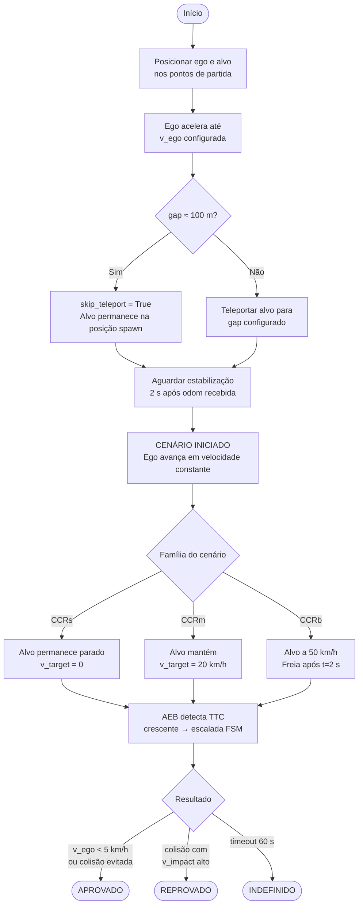
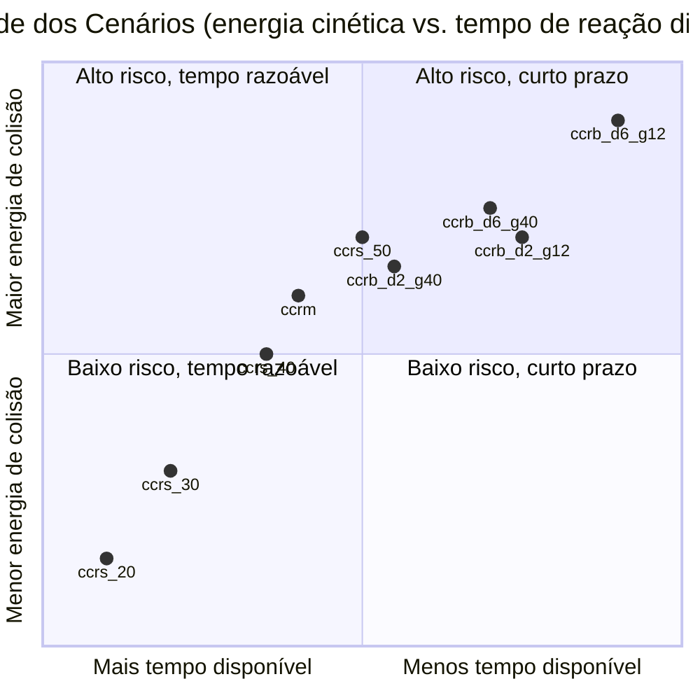
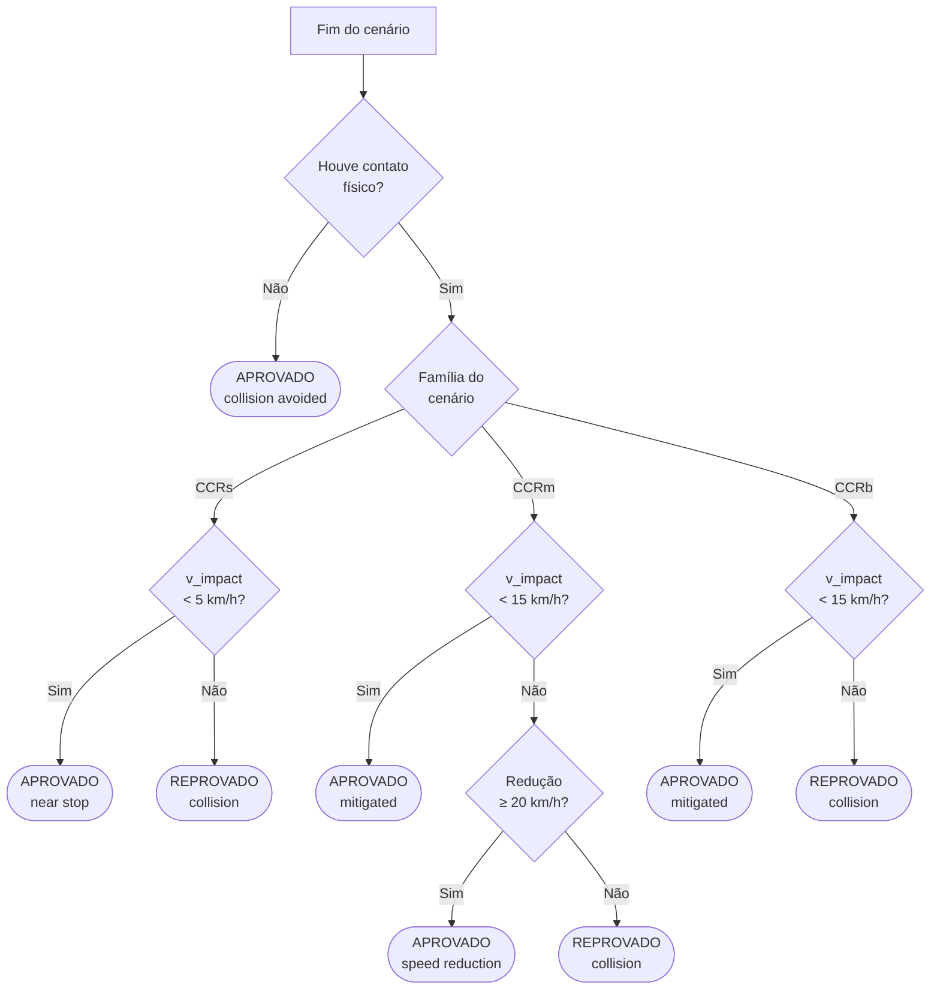
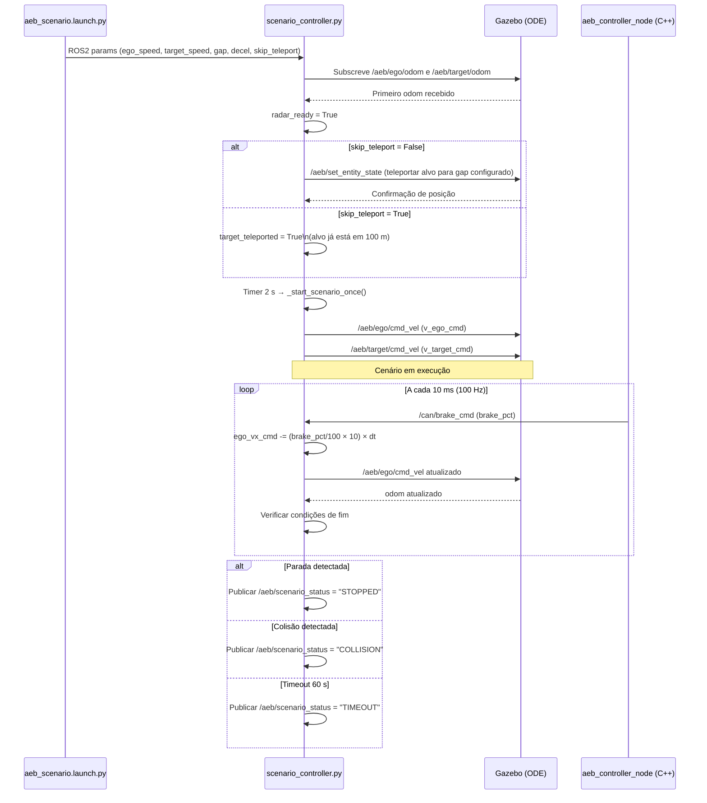
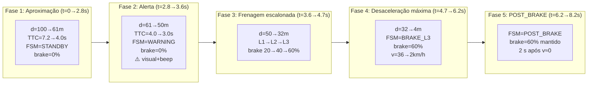

# Cenários de Teste — Euro NCAP CCR

> **Página:** Cenários de Teste
> **Relacionado:** [Home](Home.md) | [Simulação Gazebo](Simulacao-Gazebo.md) | [Análise de Requisitos](Analise-de-Requisitos.md)

---

## Navegação

- [Protocolo Euro NCAP CCR v4.3](#protocolo-euro-ncap-ccr-v43)
- [Tabela Completa dos 9 Cenários](#tabela-completa-dos-9-cenários)
- [Família CCRs — Alvo Estacionário](#família-ccrs--alvo-estacionário)
- [Família CCRm — Alvo em Movimento](#família-ccrm--alvo-em-movimento)
- [Família CCRb — Alvo Freando](#família-ccrb--alvo-freando)
- [Critérios de Aprovação (Pass/Fail)](#critérios-de-aprovação-passfail)
- [Controle pelo scenario_controller.py](#controle-pelo-scenario_controllerpy)
- [Como Executar os Cenários](#como-executar-os-cenários)
- [Interpretação dos Resultados](#interpretação-dos-resultados)
- [Modos de Falha Históricos](#modos-de-falha-históricos)
- [skip_teleport: Explicação Detalhada](#skip_teleport-explicação-detalhada)

---

## Protocolo Euro NCAP CCR v4.3

O protocolo **CCR** (*Car-to-Car Rear*) do Euro NCAP, versão **4.3**, define os procedimentos de teste para avaliar sistemas de Frenagem Autônoma de Emergência (AEB) em cenários de aproximação traseira entre veículos. É o protocolo adotado como referência de validação neste projeto, em conjunto com a **UNECE Regulation No. 152 (AEBS)**.

### Objetivos do protocolo

O protocolo v4.3 avalia três capacidades distintas do sistema AEB:

1. **Parada total** diante de um alvo completamente imóvel (CCRs)
2. **Mitigação de colisão** com alvo se movendo a velocidade menor e constante (CCRm)
3. **Reação a frenagem súbita** do veículo à frente com diferentes taxas de desaceleração e espaçamentos iniciais (CCRb)

### Condições gerais do teste (v4.3)

| Parâmetro | Especificação |
|---|---|
| **Pista** | Superfície plana, seca, µ ≥ 0,8 |
| **Temperatura** | 5 °C a 45 °C |
| **Iluminação** | > 2 000 lux (ou iluminação artificial equivalente) |
| **Alinhamento lateral** | Ego e alvo na mesma faixa, tolerância ±0,25 m |
| **Veículo alvo** | GVT (*Global Vehicle Target*) deformável, perfil de radar e visão compatível |
| **Velocidade do ego** | Controlada por ACC ou piloto experiente ±2 km/h |
| **Repetições mínimas** | 3 tentativas válidas por ponto de velocidade |

### Fluxo geral de um teste CCR



---

## Tabela Completa dos 9 Cenários

| Cenário | Família | v_ego (km/h) | v_target (km/h) | Gap inicial (m) | Decel. alvo (m/s²) | t_brake (s) | skip_teleport |
|---|---|:---:|:---:|:---:|:---:|:---:|:---:|
| `ccrs_20` | CCRs | 20 | 0 | 100 | — | — | **Sim** |
| `ccrs_30` | CCRs | 30 | 0 | 100 | — | — | **Sim** |
| `ccrs_40` | CCRs | 40 | 0 | 100 | — | — | **Sim** |
| `ccrs_50` | CCRs | 50 | 0 | 100 | — | — | **Sim** |
| `ccrm` | CCRm | 50 | 20 | 100 | — | — | **Sim** |
| `ccrb_d2_g12` | CCRb | 50 | 50 → 0 | 12 | −2,0 | 2,0 | Não |
| `ccrb_d2_g40` | CCRb | 50 | 50 → 0 | 40 | −2,0 | 2,0 | Não |
| `ccrb_d6_g12` | CCRb | 50 | 50 → 0 | 12 | −6,0 | 2,0 | Não |
| `ccrb_d6_g40` | CCRb | 50 | 50 → 0 | 40 | −6,0 | 2,0 | Não |

**Legenda das colunas:**

- **Gap inicial:** distância entre para-choque dianteiro do ego e para-choque traseiro do alvo em t = 0
- **Decel. alvo:** desaceleração aplicada ao veículo alvo após `t_brake` segundos de início do cenário (valor negativo = desaceleração)
- **t_brake:** instante (em segundos a partir do início) em que o alvo começa a frear (CCRb apenas)
- **skip_teleport:** `True` quando `|gap − 100| < 0,1 m` — o alvo já está na posição correta pelo arquivo world, evitando impulso físico indesejado

### Distribuição de severidade entre os 9 cenários



---

## Família CCRs — Alvo Estacionário

### Descrição geral

Nos quatro cenários CCRs, o **veículo alvo permanece completamente imóvel** (v_target = 0 km/h). O ego parte a 100 m de distância e avança em velocidade constante até o AEB intervir. A velocidade relativa é igual à velocidade do ego e permanece constante até o início da frenagem.

**Equação do TTC (fase de aproximação):**

```
TTC = distância / v_ego     (v_rel = v_ego, constante)
```

Com gap inicial de 100 m e v_ego = 50 km/h (13,89 m/s), o TTC inicial é ≈ 7,2 s — tempo suficiente para a FSM completar a sequência de alerta antes da frenagem máxima.

### Parâmetros individuais de cada cenário CCRs

| Cenário | v_ego (m/s) | TTC inicial (s) | d @ WARNING (m) | d @ BRAKE_L3 (m) |
|---|:---:|:---:|:---:|:---:|
| `ccrs_20` | 5,56 | 18,0 | ≈ 22 | ≈ 5 |
| `ccrs_30` | 8,33 | 12,0 | ≈ 33 | ≈ 8 |
| `ccrs_40` | 11,11 | 9,0 | ≈ 44 | ≈ 13 |
| `ccrs_50` | 13,89 | 7,2 | ≈ 55 | ≈ 18 |

### Sequência típica de estados FSM — ccrs_50

```
t= 0,0 s  STANDBY    d=100,0 m  TTC=7,2 s   v_ego=50 km/h  brake=0%
t= 2,2 s  STANDBY    d= 69,4 m  TTC=5,0 s   v_ego=50 km/h  brake=0%
t= 2,8 s  WARNING    d= 61,1 m  TTC=4,0 s   v_ego=50 km/h  brake=0%
           ↑ alerta visual + SingleBeep emitidos
t= 3,6 s  BRAKE_L1   d= 50,0 m  TTC=3,0 s   v_ego=50 km/h  brake=20%
t= 4,2 s  BRAKE_L2   d= 40,3 m  TTC=2,2 s   v_ego=45 km/h  brake=40%
t= 4,7 s  BRAKE_L3   d= 31,9 m  TTC=1,8 s   v_ego=36 km/h  brake=60%
t= 5,5 s  BRAKE_L3   d= 16,2 m  TTC=1,3 s   v_ego=22 km/h  brake=60%
t= 6,2 s  POST_BRAKE d=  4,1 m              v_ego= 2 km/h  brake=60%
t= 8,2 s  STANDBY    (2 s de POST_BRAKE concluídos)
```

> **Nota:** O limiar `WARNING_TO_BRAKE_MIN = 0,8 s` garante que o motorista receba alerta por pelo menos 0,8 s antes de qualquer frenagem autônoma, em conformidade com a UNECE R152 §5.1.4.

### Critério de aprovação CCRs

| Condição | Resultado |
|---|---|
| v_ego < 5 km/h quando d ≤ 1 m **ou** colisão não ocorre | **APROVADO** |
| Colisão com v_impact ≥ 5 km/h | **REPROVADO** |

---

## Família CCRm — Alvo em Movimento

### Descrição geral

No cenário `ccrm`, o **veículo alvo se move a velocidade constante de 20 km/h** enquanto o ego avança a 50 km/h. A velocidade relativa é 30 km/h (8,33 m/s), significativamente menor do que nos cenários CCRs, o que proporciona mais tempo disponível para o AEB reagir.

**Equação do TTC (fase de aproximação):**

```
v_rel = v_ego − v_target = 50 − 20 = 30 km/h = 8,33 m/s
TTC = distância / v_rel = distância / 8,33
```

Com gap inicial de 100 m, TTC inicial ≈ 12,0 s.

### Sequência típica de estados FSM — ccrm

```
t= 0,0 s  STANDBY    d=100,0 m  TTC=12,0 s  v_ego=50 km/h  v_target=20 km/h
t= 6,0 s  STANDBY    d= 50,0 m  TTC= 6,0 s
t= 9,6 s  WARNING    d= 20,0 m  TTC= 4,0 s  ← alerta
t=10,4 s  BRAKE_L1   d= 13,3 m  TTC= 3,0 s  brake=20%
t=11,0 s  BRAKE_L2   d=  7,5 m  TTC= 2,2 s  brake=40%
t=11,4 s  BRAKE_L3   d=  3,3 m  TTC= 1,8 s  brake=60%
t=11,9 s  POST_BRAKE  v_rel → 0              brake=60%
```

### Critério de aprovação CCRm

| Condição | Resultado |
|---|---|
| Colisão evitada | **APROVADO** |
| v_impact < 15 km/h (redução ≥ 20 km/h em relação ao cenário sem AEB) | **APROVADO** |
| v_impact ≥ 15 km/h sem redução significativa | **REPROVADO** |

O critério de **redução ≥ 20 km/h** reflete a abordagem de mitigação do Euro NCAP: mesmo que a colisão ocorra, uma redução substancial na velocidade de impacto representa diminuição significativa de lesões.

---

## Família CCRb — Alvo Freando

### Descrição geral

Os quatro cenários CCRb são os **mais severos** do protocolo. Ego e alvo partem na mesma velocidade (50 km/h = 13,89 m/s); a velocidade relativa inicial é zero. Após `t_brake = 2,0 s`, o alvo começa a frear com desaceleração constante (`−2 m/s²` ou `−6 m/s²`). A partir desse instante, a velocidade relativa cresce linearmente e o TTC colapsa rapidamente.

**Razões de maior severidade:**

1. **Gap inicial pequeno** — 12 m ou 40 m (versus 100 m nos outros cenários)
2. **v_rel parte de zero** — o AEB não detecta ameaça até o alvo começar a frear
3. **TTC colapsa em frações de segundo** para gaps pequenos e alta desaceleração
4. **Piso de distância** (`D_BRAKE_L3 = 5 m`) torna-se o mecanismo dominante em `ccrb_d6_g12`

### Dinâmica após t_brake

Após o instante `t_brake`, a velocidade relativa cresce como:

```
v_rel(t) = |decel_alvo| × (t − t_brake)
d(t)     = d_0 − ½ × |decel_alvo| × (t − t_brake)²
TTC(t)   = d(t) / v_rel(t)
```

Para `ccrb_d6_g12` (decel = −6 m/s², gap = 12 m), o TTC cai de ∞ para 1,8 s em menos de **0,65 s** após o início da frenagem do alvo. O sistema tem menos de um segundo para detectar, escalar e aplicar frenagem máxima.

### Sequência típica — ccrb_d6_g12 (cenário mais severo)

```
t=0,0 s  STANDBY    d=12,0 m  v_rel=0,00 m/s  TTC=∞      brake=0%
t=2,0 s  (alvo inicia frenagem de −6 m/s²)
t=2,1 s  STANDBY    d=11,7 m  v_rel=0,60 m/s  TTC=19,5 s brake=0%
t=2,3 s  WARNING    d=10,5 m  v_rel=1,80 m/s  TTC= 5,8 s brake=0%
t=2,5 s  BRAKE_L1   d= 9,2 m  v_rel=3,00 m/s  TTC= 3,1 s brake=20%
t=2,6 s  BRAKE_L2   d= 8,1 m  v_rel=3,60 m/s  TTC= 2,3 s brake=40%
t=2,65s  BRAKE_L3   d= 5,2 m  [piso D_BRAKE_L3=5m ativo] brake=60%
           ↑ distância ≤ 5 m → L3 forçado independente do TTC
t=3,1 s  POST_BRAKE  v_ego → v_target          brake=60%
```

> Para `ccrb_d6_g12`, o **piso de distância** é o mecanismo dominante: a distância cai para 5 m antes que o TTC atinja naturalmente 1,8 s, pois a desaceleração brusca faz v_rel crescer mais rápido do que o TTC decresce.

### Sequência típica — ccrb_d2_g40 (cenário mais brando da família)

```
t=0,0 s  STANDBY    d=40,0 m  v_rel=0,00 m/s  TTC=∞
t=2,0 s  (alvo inicia frenagem de −2 m/s²)
t=2,5 s  WARNING    d=37,5 m  v_rel=1,00 m/s  TTC=37,5 s
t=4,0 s  WARNING    d=31,0 m  v_rel=4,00 m/s  TTC= 7,8 s
t=5,2 s  BRAKE_L1   d=24,5 m  v_rel=6,40 m/s  TTC= 3,8 s brake=20%
t=6,1 s  BRAKE_L2   d=17,8 m  v_rel=8,20 m/s  TTC= 2,2 s brake=40%
t=6,7 s  BRAKE_L3   d=12,3 m  v_rel=9,40 m/s  TTC= 1,8 s brake=60%
t=8,1 s  POST_BRAKE  v_ego → v_target
```

### Tabela de severidade CCRb

| Cenário | Gap (m) | Decel (m/s²) | Dificuldade | Mecanismo dominante |
|---|:---:|:---:|:---:|---|
| `ccrb_d2_g40` | 40 | −2,0 | Baixa | TTC (tempo suficiente) |
| `ccrb_d2_g12` | 12 | −2,0 | Média | D_BRAKE_L1 e L2 ativos |
| `ccrb_d6_g40` | 40 | −6,0 | Média-alta | D_BRAKE_L1 e L2 ativos |
| `ccrb_d6_g12` | 12 | −6,0 | **Máxima** | D_BRAKE_L3 dominante (< 1 s) |

### Critério de aprovação CCRb

| Condição | Resultado |
|---|---|
| Colisão evitada | **APROVADO** |
| v_impact < 15 km/h | **APROVADO** |
| Colisão com v_impact ≥ 15 km/h | **REPROVADO** |

---

## Critérios de Aprovação (Pass/Fail)

### Resumo unificado por família

| Família | Critério de Aprovação | Critério de Reprovação |
|---|---|---|
| **CCRs** (ccrs_20/30/40/50) | Ego para completamente **OU** v_ego < 5 km/h quando d ≤ 1 m | Colisão com v_impact ≥ 5 km/h |
| **CCRm** (ccrm) | Colisão evitada **OU** redução ≥ 20 km/h na velocidade de impacto | v_impact ≥ 15 km/h sem redução significativa |
| **CCRb** (ccrb_*) | Colisão evitada **OU** v_impact < 15 km/h | Colisão com v_impact ≥ 15 km/h |

### Árvore de decisão de resultado



### Mensagens de resultado no log

O `scenario_controller.py` emite uma das seguintes mensagens ao final de cada execução:

```
*** STOPPED: distance remaining = X.X m ***     → APROVADO (parada completa)
*** NEAR STOP: gap=X.Xm v=X.Xkm/h ***          → APROVADO (quase parou)
!!! COLLISION at v_impact = X.X km/h !!!         → REPROVADO
Scenario timed out (60s)                          → INDEFINIDO
```

---

## Controle pelo scenario_controller.py

O `scenario_controller.py` é o nó Python da Camada 3 responsável por orquestrar todos os aspectos de execução de um cenário: posicionamento inicial dos veículos, controle de velocidade, recepção do comando de freio do AEB, monitoramento de fim de cenário e emissão do veredito.

### Parâmetros ROS2 recebidos pelo nó

| Parâmetro ROS2 | Tipo | Cenários típicos | Descrição |
|---|---|---|---|
| `scenario` | `string` | `"ccrs_50"`, `"ccrm"` | Nome do cenário (usado só para logging) |
| `ego_speed_kmh` | `float` | 20, 30, 40, 50 | Velocidade inicial do ego [km/h] |
| `target_speed_kmh` | `float` | 0, 20, 50 | Velocidade inicial do alvo [km/h] |
| `initial_gap_m` | `float` | 12, 40, 100 | Distância inicial entre para-choque traseiro do alvo e dianteiro do ego [m] |
| `target_decel` | `float` | 0,0, −2,0, −6,0 | Desaceleração aplicada ao alvo após `target_brake_time` [m/s²] |
| `target_brake_time` | `float` | 0,0, 2,0 | Instante de início da frenagem do alvo [s] |
| `skip_teleport` | `bool` | `True`/`False` | Pular chamada ao serviço de teleporte do Gazebo |

Esses parâmetros são injetados pelo `aeb_scenario.launch.py` com base no dicionário de configuração de cenários. O arquivo launch mapeia o nome do cenário (ex.: `ccrb_d6_g12`) para o conjunto completo de parâmetros correspondente.

### Fluxo interno do scenario_controller



### Malha de controle de velocidade do ego (100 Hz)

O `scenario_controller` aplica o comando de freio recebido do `aeb_controller_node` diretamente à velocidade do ego, convertendo pressão de freio em desaceleração:

```python
# Conversão: brake_pct [0-100%] → desaceleração [0-10 m/s²]
brake_decel = (self.brake_cmd_pct / 100.0) * 10.0

# Aplicar desaceleração à velocidade comandada
if self.brake_cmd_pct > 1.0:
    self.ego_vx_cmd = max(0.0, self.ego_vx_cmd - brake_decel * dt)

# Publicar no tópico de velocidade do Gazebo
twist = Twist()
twist.linear.x = self.ego_vx_cmd
self.ego_cmd_pub.publish(twist)
```

### Controle de velocidade do alvo (CCRb)

Para os cenários CCRb, o alvo começa a frear após `target_brake_time` segundos:

```python
# Frenagem do alvo (CCRb)
if self.elapsed >= self.target_brake_time and self.target_decel < 0.0:
    self.target_vx_cmd = max(0.0, self.target_vx_cmd + self.target_decel * dt)

twist_target = Twist()
twist_target.linear.x = self.target_vx_cmd
self.target_cmd_pub.publish(twist_target)
```

### Condições de fim de cenário

| Condição testada | Resultado reportado | Mensagem no log |
|---|---|---|
| `distance ≤ 1 m` e `v_ego > 5 km/h` | COLISÃO | `!!! COLLISION at v_impact = X.X km/h !!!` |
| `distance ≤ 1 m` e `v_ego ≤ 5 km/h` | PARADA | `*** STOPPED: distance remaining = X.X m ***` |
| `ego_vx_cmd < 0,15 m/s` e `elapsed > 2 s` | PARADA | `*** STOPPED: gap=X.Xm ***` |
| `elapsed > 60 s` | TIMEOUT | `Scenario timed out (60s)` |

### Log de status periódico (a cada 1 segundo)

```
[scenario_controller]: t=X.Xs  d=X.Xm  v_ego=X.Xkm/h  brake=X%
```

| Campo | Descrição | Unidade |
|---|---|---|
| `t=Xs` | Tempo decorrido desde início do cenário | s |
| `d=Xm` | Distância percebida ao alvo (frame CAN recebido do perception_node) | m |
| `v_ego=Xkm/h` | Velocidade atual do ego (calculada a partir de `ego_vx_cmd`) | km/h |
| `brake=X%` | Última pressão de freio recebida do `aeb_controller_node` | % |

As linhas `FSM: A -> B` são emitidas pelo `aeb_controller_node` (Camada 2) e aparecem **intercaladas** no mesmo terminal, pois ambos os nós escrevem em `stdout`.

---

## Como Executar os Cenários

### Via script run.sh (forma recomendada)

```bash
# CCRs — alvo estacionário
./gazebo_sim/aeb_gazebo/run.sh ccrs_20
./gazebo_sim/aeb_gazebo/run.sh ccrs_30
./gazebo_sim/aeb_gazebo/run.sh ccrs_40
./gazebo_sim/aeb_gazebo/run.sh ccrs_50

# CCRm — alvo em movimento
./gazebo_sim/aeb_gazebo/run.sh ccrm

# CCRb — alvo freando (combinações de decel e gap)
./gazebo_sim/aeb_gazebo/run.sh ccrb_d2_g12
./gazebo_sim/aeb_gazebo/run.sh ccrb_d2_g40
./gazebo_sim/aeb_gazebo/run.sh ccrb_d6_g12
./gazebo_sim/aeb_gazebo/run.sh ccrb_d6_g40
```

### Via ROS2 launch diretamente

```bash
# Forma canônica
ros2 launch aeb_gazebo aeb_scenario.launch.py scenario:=ccrs_40

# Outros exemplos
ros2 launch aeb_gazebo aeb_scenario.launch.py scenario:=ccrm
ros2 launch aeb_gazebo aeb_scenario.launch.py scenario:=ccrb_d2_g40
```

### Sequência completa de inicialização

```bash
# Terminal 1 — compilar (apenas na primeira vez ou após mudanças)
cd ~/aeb_ws
colcon build --packages-select aeb_gazebo --symlink-install
source install/setup.bash

# Terminal 2 — executar o cenário desejado
ros2 launch aeb_gazebo aeb_scenario.launch.py scenario:=ccrs_50

# Terminal 3 (opcional) — dashboard em tempo real (matplotlib)
source ~/aeb_ws/install/setup.bash
ros2 run aeb_gazebo dashboard_node.py

# Terminal 4 (opcional) — inspeção de tópicos CAN
ros2 topic echo /can/fsm_state
ros2 topic echo /can/brake_cmd
ros2 topic echo /aeb/scenario_status
```

### Verificação de saúde dos tópicos

```bash
# Confirmar frequências esperadas (após lançar o cenário)
ros2 topic hz /can/radar_target   # esperado: ~50 Hz
ros2 topic hz /can/ego_vehicle    # esperado: ~100 Hz
ros2 topic hz /can/brake_cmd      # esperado: ~100 Hz
ros2 topic hz /can/fsm_state      # esperado: ~20 Hz
```

---

## Interpretação dos Resultados

### Leitura do log em tempo real — exemplo ccrs_50

```
[scenario_controller]: === Scenario: ccrs_50 ===
[scenario_controller]: Ego: 50 km/h, Target: 0 km/h, Gap: 100 m
[scenario_controller]: Waiting for Gazebo to be ready...
[scenario_controller]: Odom received — Gazebo is ready
[scenario_controller]: Skipping teleport — target spawns at gap=100 m
[scenario_controller]: >>> Scenario STARTED <<<
[scenario_controller]: t=1.0s  d=86.1m  v_ego=50.0km/h  brake=0%
[scenario_controller]: t=2.0s  d=72.2m  v_ego=50.0km/h  brake=0%
[scenario_controller]: t=3.0s  d=58.3m  v_ego=50.0km/h  brake=0%
[aeb_controller]:      FSM: STANDBY -> WARNING  (TTC=4.0s d=55.6m)
[scenario_controller]: t=4.0s  d=44.4m  v_ego=50.0km/h  brake=0%
[aeb_controller]:      FSM: WARNING -> BRAKE_L1  (TTC=3.0s d=41.7m)  brake=20%
[scenario_controller]: t=5.0s  d=36.1m  v_ego=42.0km/h  brake=20%
[aeb_controller]:      FSM: BRAKE_L1 -> BRAKE_L2  brake=40%
[scenario_controller]: t=5.5s  d=22.2m  v_ego=30.5km/h  brake=40%
[aeb_controller]:      FSM: BRAKE_L2 -> BRAKE_L3  brake=60%
[scenario_controller]: t=5.9s  d=14.0m  v_ego=16.2km/h  brake=60%
[scenario_controller]: t=6.4s  d= 5.8m  v_ego= 4.2km/h  brake=60%
[scenario_controller]: *** STOPPED: distance remaining = 5.8 m ***
```

### Análise passo a passo do log



### Sinais de aprovação vs. reprovação

**Aprovação (STOPPED):**
- A linha `*** STOPPED ***` aparece no log
- A distância final (`distance remaining`) é positiva — o ego parou antes do alvo
- A velocidade no momento da parada é < 5 km/h

**Aprovação (NEAR STOP / mitigação):**
- Mensagem `*** NEAR STOP: gap=X.Xm v=X.Xkm/h ***`
- v_ego < 5 km/h (CCRs) ou v_impact < 15 km/h (CCRm/CCRb) no ponto de contato

**Reprovação (COLLISION):**
- Mensagem `!!! COLLISION at v_impact = X.X km/h !!!`
- A velocidade de impacto supera o limiar da família
- Investigar: verificar se a FSM escalou para BRAKE_L3, se o PID produziu 60%, se o POST_BRAKE manteve frenagem

**Timeout:**
- Mensagem `Scenario timed out (60s)`
- O cenário não concluiu dentro de 60 s — pode indicar problema de inicialização do Gazebo, travamento de nó, ou gap inicial incorreto

### Verificação via tópicos ROS2

```bash
# Estado FSM em tempo real (publicado a ~20 Hz)
ros2 topic echo /can/fsm_state

# Pressão de freio instantânea
ros2 topic echo /can/brake_cmd

# Alertas visual e sonoro
ros2 topic echo /can/alert

# Status final do cenário
ros2 topic echo /aeb/scenario_status
```

### Checklist de diagnóstico pós-resultado

| Sintoma | Verificação | Ação |
|---|---|---|
| FSM nunca sai de STANDBY | `ros2 topic echo /can/radar_target` — verificar `target_distance` | Checar perception_node, guarda `radar_ready_` |
| brake never > 20% | `ros2 topic echo /can/brake_cmd` — verificar valor | Checar `PID_KP` em `aeb_config.h`; confirmar BRAKE_L3 ativo |
| Colisão apesar de BRAKE_L3 | v_ego no log ao atingir BRAKE_L3 | Pode ser v inicial alta demais ou `D_BRAKE_L3` não ativo |
| Distância oscila no início | Drift do alvo (impulso ODE) | Verificar `skip_teleport` — deve ser `True` para gap=100 m |
| `SENSOR FAULT` no log | `/can/radar_target` não publicando | perception_node pode estar com falha de odom do Gazebo |

---

## Modos de Falha Históricos

Durante o desenvolvimento, os cenários falharam por diferentes razões. A tabela abaixo documenta os problemas encontrados e as correções aplicadas — importantes para entender as decisões de projeto descritas em [Análise de Requisitos](Analise-de-Requisitos.md).

| Modo de falha | Causa raiz | Cenário afetado | Correção aplicada |
|---|---|---|---|
| **FSM cai para STANDBY durante frenagem** | `V_EGO_MIN = 10 km/h`: ego desacelera e cai abaixo do limiar enquanto ainda se aproxima do alvo | CCRs a baixas velocidades (ccrs_20, ccrs_30) | Reduziu `V_EGO_MIN` para 5 km/h; adicionou pisos de distância |
| **brake nunca atinge 60%** | `PID_KP = 4`: saída máxima com `actual_decel=0` é `4 × 6 = 24%`; jerk de 10 m/s³ = 1%/ciclo → 24 s para 60% | Todos | Elevou `PID_KP = 10` e `MAX_JERK = 100 m/s³` (10%/ciclo = 6 s para 60%) |
| **POST_BRAKE libera freio imediatamente** | `target_decel = 0` em POST_BRAKE: PID retorna 0% e freio é liberado antes de completar 2 s | Todos | POST_BRAKE usa `DECEL_L3 = 6 m/s²` como setpoint fixo |
| **De-escalada prematura durante frenagem** | Com desaceleração, v_ego reduz → v_rel reduz → TTC cresce → FSM recua para WARNING ou STANDBY | CCRs a alta velocidade (ccrs_40, ccrs_50) | Adicionou pisos D_BRAKE_L1/L2/L3: FSM não recua se distância ≤ piso |
| **Drift do alvo nos CCRs** | Teleporte via `set_entity_state` para `x=100 m` quando alvo já está em `x=100 m` injeta impulso físico ODE; alvo deriva 2–3 m em 3 s | ccrs_20/30/40/50, ccrm | Implementou `skip_teleport = True` quando `|gap − 100| < 0,1 m` |
| **SENSOR FAULT na inicialização** | `radar_.target_distance = 0` (valor padrão ROS2) é < `RANGE_MIN = 0,5 m`; após 3 ciclos → `sensor_fault = True` → FSM vai para OFF | Todos | Adicionou guardas `radar_ready_ && ego_ready_` no timer callback do nó C++ |

---

## skip_teleport: Explicação Detalhada

O mecanismo `skip_teleport` é ativado automaticamente pelo `aeb_scenario.launch.py` quando a distância configurada está próxima de 100 m:

```python
# aeb_scenario.launch.py
'skip_teleport': (abs(params['gap'] - 100.0) < 0.1),
```

### Por que o teleporte causa problemas quando gap já é 100 m

O `aeb_highway.world` define o `target_vehicle` em `x = 100,0 m` — exatamente o gap configurado para CCRs e CCRm. Se o `scenario_controller` chamar `/aeb/set_entity_state` para mover o alvo **para a mesma posição em que ele já está**, o solver ODE do Gazebo interpreta a atribuição de posição como uma **colisão interna instantânea** e injeta um impulso de velocidade de aproximadamente 0,5–1,0 m/s no eixo X sobre o modelo.

**Consequências observadas:**

1. O veículo alvo deriva 2–3 m à frente nos primeiros 3 s de simulação
2. A distância percebida pelo `perception_node` é ~102–103 m em vez de 100 m
3. O WARNING demora ~0,3–0,5 s a mais para aparecer (TTC = 103/13,9 ≈ 7,4 s em vez de 7,2 s)
4. O timing de transições FSM diverge dos valores esperados pelo Euro NCAP

**Para os cenários CCRb (gap = 12 m ou 40 m):** o teleporte é **necessário e correto**, pois a posição de destino difere substancialmente de 100 m. O serviço é chamado normalmente e o impulso resultante é desprezível em relação à distância a ser percorrida.

### Comportamento do nó quando skip_teleport = True

```python
if self.skip_teleport:
    self.get_logger().info(
        f'Skipping teleport — target spawns at gap={self.initial_gap:.0f} m'
    )
    self.target_teleported = True
    # Inicia o cenário 2 s após receber o primeiro odom (estabilização do Gazebo)
    self.create_timer(2.0, self._start_scenario_once)
```

O timer de 2 s garante que o Gazebo tenha tempo de estabilizar a física antes de o ego começar a se mover, evitando transeuntes de velocidade inicial.

---

## Referências Normativas

| Documento | Descrição |
|---|---|
| **Euro NCAP AEB C2C Test Protocol v4.3** | Procedimentos de teste, condições ambientais, critérios de pontuação |
| **UNECE Regulation No. 152 (AEBS)** | Requisitos legais para sistemas AEBS em veículos de passageiros |
| **ISO 26262:2018 Part 6** | Desenvolvimento de software de segurança (ASIL-B aplicável a este sistema) |
| **MISRA C:2012** | Diretrizes de codificação C para sistemas de segurança embarcados |

---

*Última atualização: março de 2026 — Residência Stellantis/UFPE*
