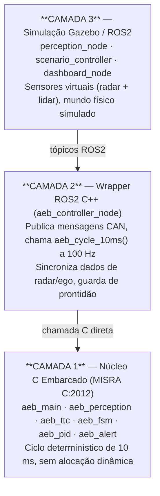

# AEB System — Wiki Principal

> **Projeto:** Sistema de Frenagem Autônoma de Emergência (AEB)
> **Vínculo institucional:** Residência Tecnológica Stellantis / UFPE
> **Repositório:** `AEB/modeling/`

---

## O que é este projeto?

Este projeto implementa um sistema completo de **Frenagem Autônoma de Emergência** (*Autonomous Emergency Braking* — AEB) para veículos de passeio. O desenvolvimento foi realizado no âmbito da residência tecnológica em parceria entre a **Stellantis** e a **Universidade Federal de Pernambuco (UFPE)**, com o objetivo de estudar, modelar e validar um sistema AEB em conformidade com os requisitos da indústria automotiva.

O sistema é capaz de detectar obstáculos à frente do veículo, calcular o *Time-to-Collision* (TTC), escalonar níveis de alerta e frenagem, e parar o veículo de forma autônoma antes de uma colisão — tudo isso dentro de um ciclo determinístico de **10 ms**.

### Motivação e contexto

Sistemas AEB são exigidos por protocolos de segurança como o **Euro NCAP** (cenário CCR — *Car-to-Car Rear*) e regulamentações como a **UNECE Regulation No. 152 (AEBS)**. A ISO 26262 classifica este tipo de sistema como **ASIL-B**, impondo requisitos rigorosos de confiabilidade e rastreabilidade de requisitos.

Este projeto serve como plataforma educacional e de prototipagem, reproduzindo fielmente as práticas de engenharia de uma ECU automotiva de produção: código C embarcado com conformidade MISRA, máquina de estados formal, controlador PID com limitador de jerk, e validação em simulação Gazebo via ROS2.

---

## Visão geral da arquitetura em 3 camadas

O sistema é organizado em três camadas independentes, cada uma com responsabilidades bem definidas:



A separação entre as camadas garante que o **núcleo de lógica de segurança** (Camada 1) seja completamente independente do middleware de comunicação (Camada 2) e do ambiente de simulação (Camada 3). Em um produto real, a Camada 1 seria compilada diretamente para o microcontrolador da ECU, enquanto as Camadas 2 e 3 seriam substituídas por drivers de hardware e um veículo real.

---

## Navegação rápida

| Página | Conteúdo |
|--------|----------|
| [Home](Home.md) | Esta página — visão geral do projeto |
| [Arquitetura do Sistema](Arquitetura-do-Sistema.md) | Design em 3 camadas, fluxo de dados, filosofia de projeto |
| [Módulos C Embarcado](Modulos-C-Embarcado.md) | Documentação detalhada de cada módulo C (percepção, TTC, FSM, PID, alerta) |
| [Máquina de Estados](Maquina-de-Estados.md) | Os 7 estados, regras de transição, histerese, POST_BRAKE |
| [Controlador PID](Controlador-PID.md) | Lei de controle, ganhos, limitador de jerk, diagnóstico de tuning |

---

## Como começar

1. Consulte o arquivo [`README.md`](../README.md) na raiz do projeto para instruções completas de configuração do ambiente.
2. Instale as dependências: **ROS2 Humble**, **Gazebo Classic**, **colcon**, compilador C99 compatível com MISRA.
3. Compile o workspace: `colcon build --symlink-install`
4. Lance a simulação: `ros2 launch gazebo_sim aeb_scenario.launch.py`
5. Monitore o dashboard: `ros2 run gazebo_sim dashboard_node`

---

## Especificações técnicas principais

| Parâmetro | Valor |
|-----------|-------|
| **Estados da FSM** | 7 (OFF, STANDBY, WARNING_L1, WARNING_L2, BRAKE_L1, BRAKE_L2, POST_BRAKE) |
| **Período de ciclo** | 10 ms (100 Hz) |
| **Padrão de codificação** | MISRA C:2012 |
| **Nível de integridade funcional** | ISO 26262 ASIL-B |
| **Cenário de validação** | Euro NCAP CCR (*Car-to-Car Rear stationary/moving*) |
| **Middleware de comunicação** | ROS2 Humble (LTS) |
| **Simulador físico** | Gazebo Classic 11 |
| **Velocidade mínima de ativação** | 1,39 m/s (5 km/h) |
| **Velocidade máxima de ativação** | 16,67 m/s (60 km/h) |
| **Faixa de detecção** | 0,5 m a 300 m |
| **Comunicação de atuação** | CAN bus (simulado via tópicos ROS2) |

---

## Requisitos funcionais de alto nível

| ID | Requisito |
|----|-----------|
| FR-PER-001 | O sistema deve validar os dados do sensor a cada ciclo de 10 ms |
| FR-TTC-001 | O TTC deve ser calculado como d/v_rel quando v_rel > 0,5 m/s |
| FR-FSM-001 | O sistema deve escalar para BRAKE_L3 em no máximo 3 ciclos após TTC ≤ 1,8 s |
| FR-BRK-001 | A variação máxima de desaceleração por ciclo deve ser ≤ 2 m/s²/ciclo (limitador de jerk) |
| FR-BRK-005 | O sistema deve manter frenagem por 2 s após v_ego < 0,01 m/s (POST_BRAKE) |
| FR-ALT-001 | Alertas visuais e sonoros devem preceder a frenagem autônoma |

---

## Estrutura de diretórios do repositório

```
AEB/modeling/
├── c_embedded/          # Camada 1: núcleo C (MISRA C:2012)
│   ├── include/         # aeb_config.h, aeb_types.h, headers dos módulos
│   └── src/             # aeb_main.c, aeb_perception.c, aeb_ttc.c,
│                        # aeb_fsm.c, aeb_pid.c, aeb_alert.c
├── gazebo_sim/          # Camada 2+3: nós ROS2 e mundos Gazebo
│   ├── src/             # aeb_controller_node.cpp, perception_node.cpp,
│   │                    # scenario_controller.cpp, dashboard_node.cpp
│   └── worlds/          # Cenários Gazebo (.world)
├── can/                 # Definições de mensagens CAN (DBC)
├── diagrams/            # Diagramas UML, FSM, fluxos de dados
├── docs/                # Documentação técnica e referências normativas
├── results/             # Logs de simulação e métricas de validação
├── python_sil/          # Software-in-the-Loop em Python para testes rápidos
└── wiki/                # Esta wiki
```

---

*Última atualização: março de 2026 — Residência Stellantis/UFPE*
